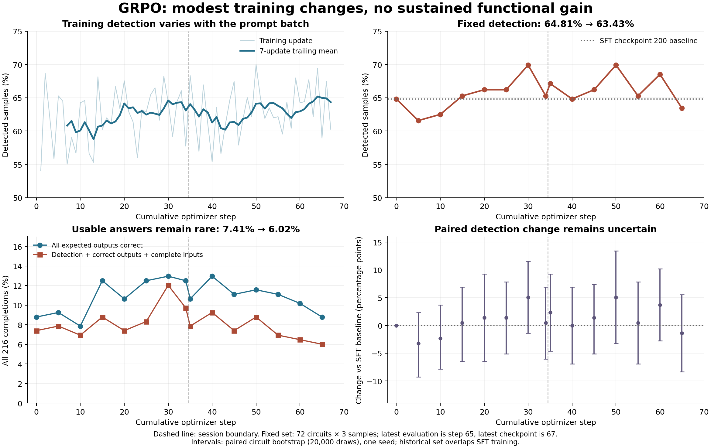

**The repaired SFT dataset is ready for a controlled experiment, but the current SFT configuration does not yet implement the full remedy or demonstrate that it will outperform the existing models.** I would not launch the original SFT configuration, or treat another 200-step run as a validated optimization. Complete the correction curriculum and representative functional validation first if the objective is better ATPG performance across the GRPO distribution.

Analysis dated September 13, 2026. This report uses both complete local W&B binary logs, 15 saved fixed evaluations, checkpoint metadata, current preprocessing/training code, a fresh full-shard preflight, and bounded simulator replay. The saved [earlier analysis](../run_5gmb8rfn/analysis.md) matches the findings quoted from “Analyze GRPO reward stagnation”; the chat itself was not accessible. No model training, checkpoint inference, dataset publication, or production code/configuration changes were performed.

**What actually ran.**

| Item | `5gmb8rfn` | `f9uuxsrt` |
|---|---|---|
| Starting weights | SFT checkpoint 200 | GRPO checkpoint 34 |
| State restoration | Fresh GRPO optimizer | Optimizer, scheduler and trainer state restored |
| Completed optimizer updates | 1–34 | 35–67 |
| Dataset | Original `chrivasileiou/asap7-language-of-test-v2` | Same original dataset |
| Accumulation / generations | 384 / 16 | 384 / 16 |
| LR / warmup | `5e-6` / 10 updates | Same cosine schedule continued |
| Mean interval between logged updates | 82.19 minutes | 75.33 minutes |
| W&B history records | 47,620 | 47,619 |

The second session is a continuation, not an independent replication. Its launch log explicitly loads both adapters from checkpoint 34 and restores optimizer/scheduler state. Its first training LR is `4.875e-6`, declining to `4.345e-6` by step 67; warmup did not restart. Checkpoints 34 and 67 have the same ordered training-buffer hash and 51,180 rows. The fixed-evaluation manifest hash, decoding protocol, tokenizer and template hashes also match throughout. This is strong evidence of continuation consistency, although it is not a bit-for-bit interrupted-versus-uninterrupted trajectory experiment.

Both allocations ended at scheduling limits. The first job was cancelled on September 11; the second ended when its reservation expired on September 13. Checkpoint 67 is resumable. **There is no saved fixed evaluation of checkpoint 67; the latest is step 65.** Update intervals include intervening evaluation/checkpoint overhead and exclude startup before the first logged update.

The previous report stopped at step 14. Its observation that there had been little time at peak LR is now outdated: 67 updates completed, and the resumed session stayed near peak LR. A longer warmup is no longer an adequate explanation of the plateau.

**The rewards tell two different stories.**

`train/reward` is approximately zero by construction. The custom trainer logs the raw weighted score, normalizes each objective within its prompt group, combines those objectives, centers/scales the resulting advantages, and substitutes those advantages into the value TRL subsequently calls reward. Across both sessions the displayed mean remains within approximately `±7.5e-9`. It should not ascend with model quality. See [GDPO centering](../../atpgllm/training/gdpo.py:140) and [raw logging / advantage substitution](../../atpgllm/training/dual_adapter_grpo_trainer.py:1147). Group-relative advantages are also described in the [versioned TRL GRPO documentation](https://huggingface.co/docs/trl/v0.26.0/grpo_trainer); the zero-mean dashboard behavior here comes specifically from this repository's substitution.

The raw metrics show modest training improvement, not total absence of learning:

| Training metric, mean across updates | Updates 1–34 | Updates 35–67 |
|---|---:|---:|
| Detection | 62.09% | 63.10% |
| Weighted raw score | 0.9086 | 0.9241 |
| Exact expected-output correctness | 6.95% | 9.34% |
| Detection-gated output fidelity | 0.4095 | 0.4253 |
| Completion truncation fraction | 2.13% | 1.23% |

Training batches contain different circuits/faults, so these are descriptive comparisons, not matched causal estimates. A later 10-update window, steps 58–67, averages 64.30% detection. Some progress is visible, but it does not reliably transfer to complete usable answers on the frozen tasks.

The raw weighted score is `detection + 0.25 activation + 0.20 fidelity + 0.05 format`; it is not a probability. GDPO applies those weights after objective normalization during optimization. In [the actual reward](../../atpgllm/llm/reward_funcs.py:464), fidelity is `detection × fraction_of_correct_outputs`, and format is also detection-gated. Thus a detecting vector with several wrong expected outputs still earns positive detection and partial fidelity reward. Correcting outputs on a non-detecting vector earns no fidelity reward. This objective differs from the product requirement that every input/output assignment be usable; it helps explain why a detection curve alone is insufficient, without proving the reward weighting caused the plateau.

**Functional performance has not improved consistently.**

Every evaluation uses the same 72 faults on distinct circuits, with three completions per fault. Percentages below use all 216 completions, including malformed answers. “Usable” means target detection, all canonical expected outputs correct, and complete binary canonical inputs; it does not certify every additional claimed fault.

| Evaluated checkpoint | Detection | At least one detection in 3 | Exact outputs | Usable |
|---|---:|---:|---:|---:|
| SFT 200 / GRPO step 0 | 64.81% (140/216) | 88.89% | 8.80% | 7.41% (16/216) |
| GRPO 30 | 69.91% (151/216) | 90.28% | 12.96% | 12.04% (26/216) |
| GRPO 34, at restart | 65.28% (141/216) | 86.11% | 12.50% | 9.72% (21/216) |
| GRPO 50 | 69.91% (151/216) | 87.50% | 11.57% | 8.80% (19/216) |
| GRPO 60 | 68.52% (148/216) | 91.67% | 10.19% | 6.48% (14/216) |
| GRPO 65 | 63.43% (137/216) | 88.89% | 8.80% | 6.02% (13/216) |

Step 65 minus baseline detection is **−1.39 percentage points**, with a paired circuit-bootstrap 95% interval of **−8.33 to +5.56 points**. Fourteen faults improve, 18 worsen, and 40 retain the same detection count. Relative to the restored step-34 policy, the difference is −1.85 points, with interval −9.72 to +5.56. These intervals include zero; the data do not prove either improvement or degradation.

GRPO checkpoint 30 is the strongest observed usable-answer checkpoint and deserves retention as a comparison candidate. It is **not established as the best checkpoint**: its detection gain of +5.09 points has interval −1.39 to +11.57, it was selected retrospectively among many evaluations, and the historical set overlaps original SFT data. Do not confuse GRPO checkpoint 30 with SFT checkpoint 30.

All intervals resample the 72 circuit/fault groups, retaining each group's three samples, using 20,000 bootstrap draws and seed 1729. They describe this bounded set and single evaluation seed, not generalization across training seeds, arbitrary circuits, or an independent final test set. All per-step values are in [the evaluation CSV](fixed_evaluation_metrics.csv) and [summary](summary.json).

**The learned response procedure remains the clearest behavioral problem.**

I re-simulated 3,182 parseable saved answers from 3,240 completions. Detection and exact-output results agree with the logged components in every replay. The remaining 58 lacked usable final inputs for replay; they remain in evaluation denominators. This validates the reported outcomes against the current simulator, rather than assuming the saved reward charts are correct.

| Behavior | Baseline | GRPO 30 | GRPO 65 |
|---|---:|---:|---:|
| Final output repeats pre-tool guess | 206/207 comparable | 211/212 | 213/214 |
| Repeated guess is wrong | 187 | 183 | 194 |
| Responses with multiple tool calls | 1/216 | 0/216 | 0/216 |

Only nine of all 3,240 responses contain multiple tool calls. At step 65, 213/214 comparable final input vectors also equal the first tool input. All 216 completion texts remain distinct within their prompt groups; only one of 72 groups repeats an identical input vector across all three samples. This supports a persistent one-proposal/no-repair procedure, not wholesale identical-output collapse. [Replay evidence](completion_audit.json).

Reward contrast and gradients are present. Detection varies within 79.49% of groups in session one and 72.64% in session two; mean scalar zero-variance fractions are only 1.18% and 1.35%. Entropy averages 0.04075 and 0.03950, with the final 10-update mean 0.03807: some decline, but no observed collapse. KL increases to a final-window mean of 0.00544. Gradient norms are nonzero, with a maximum 0.628. The accumulation correction is consistently `1/24`; the original missing-normalization issue is not an unresolved explanation here. Zero PPO clipping is compatible with `num_iterations=1` and unchanged policy weights within an accumulated update. Trainer/vLLM mean sampled-log-probability differences remain small (session means 0.0156 and 0.0166), although token-level outliers exist. These logs do not establish stale serving weights, exploding gradients, complete gradient starvation, or a mathematical local minimum.

With three training ranks, batch size one and accumulation 384, each update consumes 1,152 completions / 72 prompt visits. Sixty-seven updates correspond to approximately 77,184 training completions and 4,824 prompt visits, or 9.43% of the retained buffer. Visits are not necessarily distinct semantic tasks. Expensive updates limit experimentation, but merely increasing the number of updates does not address incorrect supervision or teach a missing correction procedure.

**Status of the five previous recommendations.**

| Recommendation | Current implementation | Assessment |
|---|---|---|
| 1. Repair STIL mapping and consistent labels | Explicit STIL mapping; width/port checks; output agreement, target detection and snapshots verified; auxiliary fault claims repaired | Implemented for the supported combinational format; current audit passes |
| 2. Circuit-disjoint validation including GRPO sizes | Eight grouped holdouts; zero audited identity/module overlap; only 2–12-gate candidates; SFT prompt cap still 2,048 | Small development holdout implemented; broad size coverage and separate test holdout missing |
| 3. Teach failed proposal → simulation → correction | Same successful vector appears in first tool call and final answer; one tool response | Not implemented |
| 4. Select by functional validation | SFT evaluates at zero/every ten updates and loads lowest `eval_loss` checkpoint | Teacher-forced validation implemented; generated functional selection missing |
| 5. Short GRPO pilot: accumulation 96, LR `2e-6`, warmup 2, 16 generations | Pilot file has accumulation 384, LR `1e-6`, warmup 2, 16 generations, original dataset and old SFT checkpoint 200 | Not the proposed ablation; must be updated after selecting repaired SFT |

The [repaired SFT configuration](../../scripts/train/configs/sft_granite_4.2_8b_repaired.conf) starts from **base Granite weights** and creates a new adapter. It does not improve or continue checkpoint 67 in place. The [original SFT configuration](../../scripts/train/configs/sft_granite_4.2_8b.conf) still uses the defective Hub dataset and lacks the new circuit-validation switch. The original and resumed GRPO configurations likewise still point at the original dataset. Editing preprocessing files alone did not change the data consumed by either GRPO session.

**What the repaired-data validation proves—and what remains untested.**

The new preflight passes with the same dataset-manifest hash as job 390743: `ff3c01911df9311083c99c1cfde31ae3fe79361595fc368b4fdc82104d033948`. It rechecks every shard checksum, row identity, split membership and count: **986,853 train rows, 432 validation rows**, with zero overlap in circuit IDs, normalized netlist IDs or actual module names. It also verifies token lengths and nonempty aligned assistant masks for all 63 selected validation examples, plus formatting of the first retained training example. It does **not** token-audit every training sequence or measure generated model performance. [Fresh preflight](current_preflight.json).

An additional bounded replay covers **all 432 validation rows plus 254 rows from 64 sampled training source shards**, 686 rows across 74 source circuits. Every sampled PI/PO assignment matches source STIL, every target detects, every expected output is correct, and every stored Good/Bad snapshot entry matches recomputation. Sampling is uniform over chosen training shards, up to four rows each, not uniform over all training rows. These checks support the repair; they are not an independent full-dataset formal proof. [Replay details](repaired_replay.json).

The repair is conservative: it keeps 2,247 of 3,388 source circuits in scope and quarantines 1,141. The documented first-failure breakdown includes 1,000 circuits with at least one translated DS fault not detected by the custom net-fault simulator. Other exclusions include missing artifacts and unsupported patterns. This avoids contradictory targets but changes the training distribution; it does not demonstrate that the excluded circuits are intrinsically untestable. Existing TetraMAX artifacts are checked, but TetraMAX was not rerun. [Repair contract and limitations](../../../data_preprocessing/MAPPING_REPAIR.md).

The validation set represents eight normalized circuit groups, ten source variants, and **63 selected faults**, with prompts **559–1,193 tokens**. It contains no GRPO-sized prompts. In the historical GRPO set, 46/72 prompts exceed the SFT cap. At step 65, short-prompt detection is 73.08% versus 57.97% for long prompts; usable-answer rates are 14.10% versus 1.45%. Size and circuit difficulty are confounded, but the coverage gap is real. [Length strata](length_strata.json).

An identity/module comparison also finds **52/72 historical evaluation circuits in the repaired train split**, and none in its validation split. This is presence in the raw repaired dataset, not proof that all 52 survive filtering and are actually consumed during a particular SFT run. The historical set must remain a regression benchmark. It cannot be reused as an unseen SFT holdout.

The [conversation builder](../../atpgllm/training/conversation.py:363) still supplies the correct target vector and expected outputs in the first tool call, then ends with a success claim. After repair those claims are consistent, which is a substantial improvement. However, copying the first guess is still always correct in these demonstrations; there is no supervised reason to learn a second proposal or correct a wrong first output prediction. Teacher-forced validation also supplies the correct previous assistant/tool context, so lower loss does not establish recovery from self-generated mistakes.

**Recommended decision and concrete next experiment.**

1. Preserve SFT 30/80/200 and GRPO 30/50/67 as controls. Existing SFT checkpoints 30 and 80 were not evaluated in this analysis; their relative quality remains unknown. Keep checkpoint 67 as the latest training state, not an automatically superior deployed policy.
2. Before the main new SFT run, reserve validation and final-test circuit groups covering both below-2,048 and 2,048–4,096-token prompts. Exclude every reserved group from training before SFT. Raise the training prompt limit to cover the intended deployment distribution, then repeat full-sequence/mask checks and measure memory on that actual curriculum. Preserve the original repaired build and version the new split/curriculum separately.
3. Add simulator-verified demonstrations of (a) failed detection followed by a revised input and successful second simulation, and (b) a detecting input with a wrong initial expected output corrected from the tool. Only claim success when the final complete vector detects and its outputs agree. Measure correction rate conditional on an initially failed proposal; count of tool calls alone is insufficient.
4. Use the current repaired recipe as a label-repair control if a small initial experiment is desired. A new SFT adapter on repaired data is a plausible improvement, particularly for output correctness, but the effect size and detection benefit are unknown. Select candidates using generated usable-answer rate and detection on the clean validation set; keep loss as a diagnostic. Compare identical decoding/tool limits over multiple seeds. If the original 63-example validation remains in use, report uncertainty over eight circuits rather than treating 63 correlated faults as independent evidence.
5. Promote a checkpoint only after it improves the predeclared functional objective without an unacceptable detection regression, including the long-prompt stratum. Compare with the base-model baseline as well as current policies; old policies may have seen circuits in newly repaired holdouts. Use the untouched final test set once for the final selection. A lowest-loss checkpoint that is functionally worse should not be promoted.
6. Only then run the proposed GRPO ablation: accumulation 96, LR `2e-6`, warmup two, 16 generations and 16 steps per generation, keeping the current reward/decoding settings initially. At three ranks this gives 288 completions / 18 prompt visits per update and accumulation scale `1/6`. Compare against accumulation 384 at matched generated-token or wall-clock budgets, not identical update counts. Both arms must start from the same repaired-data SFT checkpoint, use the new training split, and preserve the new holdouts. These hyperparameters remain hypotheses, not established optima.

For dashboards, prioritize `eval_fixed/detection`, exact outputs, complete binary inputs, the usable-answer conjunction, correction success, cost and size strata. Track raw weighted training reward separately from normalized `train/reward`. The existing fixed evaluation logs the marginal metrics but not their usable-answer conjunction; this report calculates it from saved per-completion records.

**Verification and reproducibility.** All **59 targeted tests passed** across mapping, SFT validation, GDPO, reward objectives, fixed evaluation and accumulation loss. [Test log](tests.log). The repaired preflight passed again locally. The earlier stored CPU smoke test verifies evaluation and best-loss checkpoint plumbing on a tiny model; it is not evidence of Granite ATPG improvement. No production Granite training or new inference was run, so there is no empirical basis to promise that launching SFT will optimize these models.

The analysis scripts and outputs are isolated in this directory. Run `analyze.py`, `replay_evaluations.py`, `audit_repaired.py`, and `plot_results.py` with `/work/cxv200006/myenv/bin/python` from the workspace. `analyze.py` reads local W&B logs, `replay_evaluations.py` reruns the custom simulator, and `audit_repaired.py` compares source STIL and repaired rows. Exports: [training CSV](training_metrics.csv), [fixed-evaluation CSV](fixed_evaluation_metrics.csv), [summary JSON](summary.json), [PNG figure](diagnostics.png), [PDF figure](diagnostics.pdf).

The requested Analytics Dashboard, Design Report and Experiment Analysis template workflows could not run: no advertised document/spreadsheet creation capability or connected document session was available. Their SKILL.md files explicitly require stopping that workflow in this situation. Their retained reference files were left unchanged; this Markdown analysis and standalone plots do not claim template fidelity.
