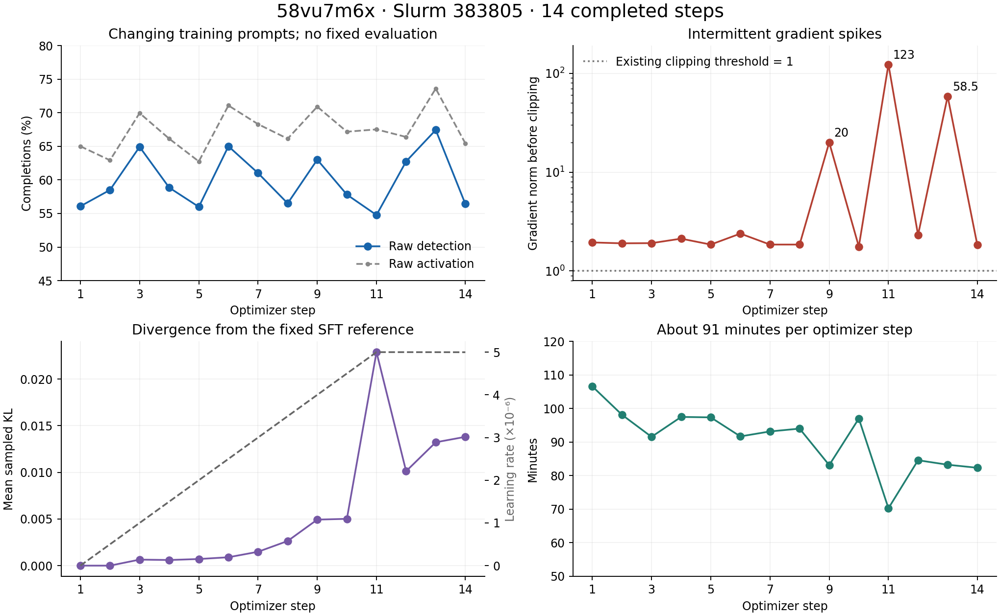

**Run 58vu7m6x: fix loss scaling and prompt construction before tuning for reward growth.**

Analysis snapshot: September 9, 2026, through optimizer step 14. Slurm job 383805 was RUNNING at inspection, with approximately 21 h 50 min elapsed against a 48-hour allocation. These conclusions describe the inspected snapshot, not subsequent training.

The run is operating without an observed fatal/OOM failure, but has intermittent gradient spikes and no demonstrated improvement on a fixed evaluation set. The two directly reproduced implementation problems are DAPO accumulation scaling and duplicate assistant prefixes. Several other corrections already exist in the working tree; their presence today does not establish that the running process loaded them.

| Measurement | Observed result | Interpretation |
|---|---:|---|
| Completed optimizer steps | 14 | W&B's much larger internal history index includes profiling events. Use `train/global_step`. |
| Raw detection, steps 1–5 versus 10–14 | 58.87% → 59.84% | A 0.97 percentage-point descriptive change on different prompts; not evidence of a reliable improvement. |
| Raw detection, individual steps | 54.77–67.45% | Training difficulty and sampling variation are substantial. |
| Gradient norm before clipping | Usually 1.77–2.39; spikes 20, 123, 58.5 at steps 9, 11, 13 | Investigate scaling and outlier contributions. Clipping at 1.0 is already enabled. |
| Sampled reference KL | 0 initially; peak 0.02289; latest 0.01381 | Reference divergence grows near peak LR; mean KL alone cannot identify the source of outliers. |
| Token entropy, first five versus last five steps | 0.03928 → 0.04352 | No observed entropy collapse over this interval. |
| Completion truncation, first five versus last five | 4.50% → 2.53% | Improving; a lower length cap needs measurement. |
| Exact expected-output accuracy, first five versus last five | 3.21% → 7.12% | Output reporting remains weak; this metric requires all scored primary outputs to match. |
| Mean optimizer-step duration | 90.77 min | Approximately 32 steps fit in 48 hours at this rate; 200 steps would require about 12.6 days. |

Source metrics are exported in [metrics.csv](metrics.csv) and [metrics.json](metrics.json). The 14 optimizer records were independently checked against the local W&B binary history and checkpoint-14 history. The binary snapshot contained 18,064 history records, mostly profiling, and 10,415 system records.

**1. Highest priority: correct DAPO normalization across accumulation.**

The allocation has **three training ranks and one vLLM GPU**. With batch size 1, `STEPS_PER_GENERATION=16`, `NUM_GENERATIONS=16`, and accumulation 384:

- Each global generation batch has `3 × 1 × 16 = 48` completions, covering three prompts.
- Each optimizer step consumes `3 × 1 × 384 = 1,152` completions, covering 72 prompt visits.
- There are `384 / 16 = 24` separate generation batches per optimizer step.

The custom trainer returns the token count of one generation batch as `num_items_in_batch`. The installed TRL DAPO loss divides each microbatch's token-loss sum by that generation batch's token count divided by world size. The scalar denominator is copied into each of the 16 slices. Transformers' usual extra accumulation division is explicitly bypassed by TRL. Consequently, accumulation sums 24 independently normalized batch losses instead of averaging them.

The CPU reproduction extracts the installed `_compute_loss` implementation directly and uses identical two-token synthetic microbatches. Across 384 accumulation steps it produces gradient **−24** when generation uses 16 microsteps, versus **−1** when generation covers all 384. This isolates a **24× scaling discrepancy**. It does not establish that Adam parameter updates are 24× larger: Adam adaptation and clipping matter. Nor does it prove that this constant factor causes the intermittent spikes. It does invalidate interpreting gradient norms or changing accumulation settings without accounting for normalization.

Fix the optimizer-step normalization explicitly. For an objective averaging generation batches in this aligned configuration, multiply each batch-normalized contribution by `16/384`. For exact token averaging over the entire optimizer step, use the full step's valid-token denominator, with correct DDP scaling and masking; variable completion lengths make these two objectives different. Validate chunk-size invariance on the same samples, including variable lengths and tool masks, before retuning LR. Do not simply set generation size to 384: that expands the generation batch from 48 to 1,152 completions and may create a memory problem.

Evidence: [custom generation/token counting](../../atpgllm/training/dual_adapter_grpo_trainer.py), installed `/work/cxv200006/myenv/lib/python3.11/site-packages/trl/trainer/grpo_trainer.py` at lines 512, 1750, and 2231, and Transformers `trainer.py` at lines 4059 and 5442. The relevant denominator and cache-reset behavior also appear in [upstream TRL v0.26.1](https://github.com/huggingface/trl/blob/v0.26.1/trl/trainer/grpo_trainer.py). Findings about execution use the installed source.

**2. Correct the prompt round trip and preserve rollout/policy consistency.**

All **42 saved prompt examples** end with two assistant/`<think>` prefixes. This is not just a display hypothesis: a CPU reproduction with the SFT checkpoint's tokenizer confirms the sequence:

1. Dataset formatting renders a prompt with `add_generation_prompt=True`.
2. `revert_chat_template` interprets the unfinished assistant prefix as an assistant message.
3. Initial generation renders those messages with `add_generation_prompt=True` again.

The result contains a completed assistant message holding `<think>`, followed by another assistant generation prefix. Keep structured prompt messages until the final render, or remove only the unfinished generation suffix before parsing. Preserve legitimate assistant history and tool turns. Verify one generation prefix, prompt-token equality, prefix preservation, and tool-mask/log-probability alignment through continuations.

Evidence: [dataset formatting](../../atpgllm/training/dataset_utils.py), [ChatML parser](../../atpgllm/training/revert_template.py), [initial generation](../../atpgllm/training/dual_adapter_grpo_trainer.py), and [saved completion tables](../../wandb/run-20260908_144532-58vu7m6x/files/media/table).

The original custom weight-sync override also omitted TRL's prefix-cache reset. The current working tree contains that correction, with trainer-file modification time 18:11 on September 8, after this job loaded its trainer. Confirm that the next job actually loads it. If prefix caching is enabled, cached states must be invalidated after weight changes. I did not measure how much cached state affected this run.

Trainer-versus-vLLM mean absolute token-log-probability differences are **0.107–0.146**; logged batch maxima average **31.6–35.5**, and the importance-ratio maximum reaches the cap of 3 throughout. The initial step already has a mismatch, so stale caches alone cannot explain it. The trainer uses NF4 weights and the custom sync exports dequantized/merged BF16 weights, making numerical differences another plausible contributor. Measure the fraction hitting the cap, quantiles of the differences, and pre/post-tool differences on identical tokens. Keep the existing importance correction during this investigation.

**3. Establish a fixed, raw evaluation signal and verify reward semantics.**

The logged `reward` is a normalized GDPO advantage: each objective is normalized within prompt groups, the weighted result is normalized again, and that result is returned to TRL as its reward. Its mean is approximately zero by construction. It cannot be the ascending quality curve.

Use **raw simulator detection / sampled pass@1 on a frozen evaluation set** as the primary metric. Hold prompts, faults, generation settings, and evaluation seeds fixed; evaluate the SFT starting point and then every few optimizer updates. Keep held-out circuit identities separate from GRPO training and document possible prior SFT overlap. Compare paired per-fault results, with repeated seeds or uncertainty estimates clustered by circuit. A 72-fault pilot is useful for large regressions; it cannot reliably establish a one-percentage-point gain.

This run had `eval_strategy=no` and `eval_on_start=False`. The existing [pilot config](../../scripts/train/configs/grpo_granite_4.2_8b_pilot.conf) and [fixed-evaluation implementation notes](../../scripts/train/FIXED_EVALUATION.md) already provide a 72-fault, three-generation evaluation protocol and SFT baseline. They are a useful starting point after priorities 1–2; the pilot retains accumulation 384 / generation 16 and therefore still inherits the loss-scaling issue.

Also distinguish simulator failures, unusable predictions, and valid-but-undetected faults. The current reward code adds authoritative dataset-fault selection and simulation-valid/error metrics, but those error metrics are absent from this run's records. Verify these changes with known detecting/non-detecting vectors and indexed/escaped fault names. The committed older fault regex truncated `y[16]` to `y`; the working factory file has a corrected regex and a modification time **before this run launched**. Therefore this analysis does **not** claim that the old regex corrupted this run. A frozen source snapshot is needed to establish exact launch contents.

Use the gathered `rewards/reward_fn/component_mean/detection` for global training detection. The separate `diagnostics/group_sampling/.../pass_at_1` and netlist-diversity metrics only report rank 0's local slice. `unique_in_generation_batch=1` is expected here: each rank receives one complete 16-completion prompt group, while the global batch has three prompts. It does not demonstrate a broken diversity sampler. Fix global diagnostic aggregation and its rolling-window accounting before changing sampling based on those metrics.

**4. Then tune learning rate and diagnose outlier gradients.**

The run's recorded settings already include LR `5e-6`, ten warmup steps, `beta=0.03`, fixed SFT reference, `max_grad_norm=1`, dropout disabled, temperature 1, and top-entropy quantile 0.8. Adding KL or enabling clipping is not a missing fix. Zero policy-clipping ratios are compatible with `num_iterations=1` and aligned generation/accumulation: rollout and loss policy weights have not changed within an update. Tightening epsilon is unlikely to address these spikes under that execution pattern. TRL documents the single-iteration case in its [GRPO objective explanation](https://huggingface.co/docs/trl/v0.26.0/en/grpo_trainer).

After normalization and prompt corrections, use a fresh SFT-started pilot with **LR `1e-6`, two warmup steps, and 20 optimizer steps**, preserving the current KL, dropout, sampling, and reward weights initially. This is a conservative experimental starting point, not a proven optimum. The existing pilot already exposes these values. Changing LR now without fixing scaling leaves the underlying inconsistency.

Record tail KL, maximum/quantiles of advantage magnitude, clipping frequency, and the fault/prompt identity of extreme loss contributions. Mean KL does not reveal rare exponential KL outliers. Use fixed evaluation to decide whether a larger LR is justified; avoid extending simply because the training average briefly rises. Maintain the current objective priorities initially: detection already has weight 1.0, activation 0.25, fidelity 0.20, and format 0.05, and fidelity/format are gated by detection. Reporting accuracy remains a later targeted ablation.

**5. Make checkpoint ownership and Slurm recovery unambiguous.**

The active [resume config](../../scripts/train/configs/grpo_granite_4.2_8b_resume.conf) uses `RESUME_FROM=latest` in a reused output directory. The launcher resolves latest by **highest checkpoint number**, not run identity or file modification time. At inspection:

| Directory | trainer_state.json modification time | Provenance evidence |
|---|---|---|
| checkpoint-14 | September 9, 12:08 | Matches this run's first detection 0.560764 and step-14 history. |
| checkpoint-24 | September 8, 14:15 | Predates this job; first detection 0.118924 differs from this run. |

Thus `latest` would currently resume the **previous run's checkpoint-24**. Use a distinct output directory per experiment, and an explicit checkpoint from the intended run for recovery. Preserve optimizer, scheduler, RNG, and the original stream offset for genuine crash recovery. Record run/job ID and configuration/source hashes inside checkpoint metadata. Do not treat a new-data experiment as crash recovery; only about 1,008 prompt visits occurred in the first 14 steps, while the buffer-skip bookkeeping advances by 60,000 for a fresh run.

The submit wrapper freezes the shell config but not the Python training modules. Freeze the actual source revision plus dirty diff, and capture the effective configuration and relevant dependency sources. Current working-tree edits will not retrofit an already imported training process. About 32 updates fit this allocation at observed speed; full-state recovery across allocations or a shorter experimental target is required for 200 updates. Keep a completed checkpoint available before wall-time expiration.

**6. Improve reward gain per GPU-hour after correctness and evaluation.**

The completed training steps total 21.18 hours. Reported generation/tool-loop time, averaged over the 24 generation calls per optimizer step, accounts for approximately **63.7%** of that time. Reward-function profiling is about eight seconds per generation batch, roughly 3.6% of total observed training time. Weight synchronization averages 1.24 seconds per optimizer-step sync. These measurements prioritize rollout throughput over optimizing the weight-transfer path or adding simulator CPUs blindly; profiling scopes overlap and should not be summed indiscriminately.

After the corrected pilot, test **8 generations with accumulation 192** as a separate experiment: it keeps 72 prompt visits per update (`3 × 192 / 8`) with half as many completions. It trades within-group exploration for throughput, so verify detection, all-fail groups, and advantage variance on the same evaluation protocol. The normalization correction must remain valid for the new accumulation ratio. Do not increase group size based on a presumed lack of reward variance: the detection objective varies within roughly 74–90% of global groups, and logged local scalar-degenerate groups are uncommon.

Measure generated-token and tool-response-token distributions before reducing the 12,288-token completion cap. Training GPUs reserve roughly 50–53% of device memory while the vLLM GPU reserves 92%; training rank 1/2 GPU-busy percentages near 99% coexist with tensor-pipeline activity near 8%. Busy percentages alone do not establish compute saturation and can include collective waiting. Test larger serving batches or changed topology only after profiling the actual wait and generation costs.

**Validation and scope.** The [CPU reproductions](reproduce_findings.py) both passed: 24× synthetic gradient scaling and duplicated tokenizer prefix. The [plotting script](plot_metrics.py) regenerated 14 metric rows and PNG/PDF charts, and the chart was visually inspected. This work adds analysis artifacts only; it does not submit or cancel jobs or modify training code/configuration. GPU end-to-end validation of the proposed corrections remains future implementation work. The practical target is improving fixed-evaluation detection with controlled variance and cost; individual stochastic training rewards will not rise monotonically.
