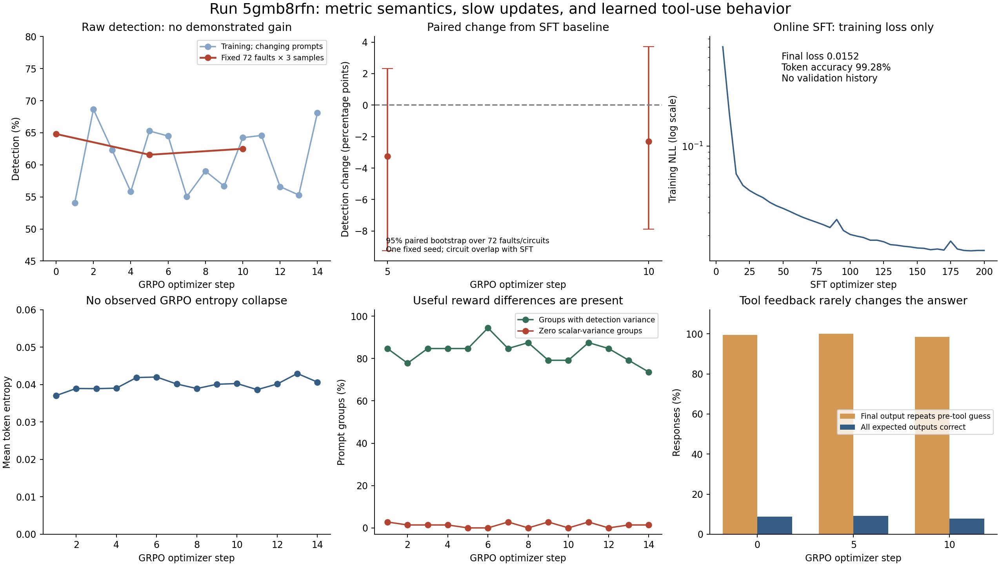

**The strongest finding is corrupted SFT supervision from a signal-order bug. Fix the data before committing to another long GRPO run.**

Snapshot: September 10, 2026; GRPO run `5gmb8rfn` through optimizer step 14, with fixed evaluations at steps 0, 5 and 10. I retrieved the online SFT run [chrivasileiou/sft-training/n5wplmt8](https://wandb.ai/chrivasileiou/sft-training/runs/n5wplmt8), exported all 41 history rows, and matched its 40 loss records to the local checkpoint-200 history. The conclusions below distinguish directly reproduced defects from plausible training effects. No training jobs, production code, or dataset uploads were changed.

**1. A confirmed dataset-construction bug teaches incorrect answers.**

The preprocessing pipeline reads TetraMAX pattern bitstrings and assigns bits using `optimized_netlist.input_nets` and `output_nets`. Those lists follow Verilog declaration order, with buses expanded from index zero upward. TetraMAX instead defines the actual pattern order in STIL `_pi` and `_po` signal groups. These orders differ both in bus direction and in the placement of scalar versus bus ports. Changing only bus direction would not fully repair the problem.

Evidence: [pattern-to-signal mapping](../../../data_preprocessing/final_dataset_creation.py:57), [net expansion](../../../data_preprocessing/netlist_utils.py:80), and the original [ex_102 STIL file](../../../data/freeset/out.freeset.asap7sc7p5t_28.rvt.tt/4077_ex_102_test_vector_and/simulation.stil:50).

I downloaded one pinned training shard, revision `ece55a615c6289ca8b8a742bd63d4138e15c127f`, containing 22,840 examples. Among 23 labels for 17 netlist/fault tasks also present in the evaluation manifest, **20 labels disagree with current good-machine output values**. None of those discrepancies is explained by missing output names. Twenty-two of the 23 input vectors still detect the requested fault, so filtering for detection alone does not establish correct expected outputs. This is a targeted sample, not an estimate of the corruption rate across the entire dataset.

Two examples are independently proven using Boolean expressions from the netlists, without calling the project's simulator:

| Online training-shard row | Circuit / original pattern | Proof |
|---|---|---|
| 20,451 | `ex_102_test_vector_and`, pattern 15 | `a[1]=1`, `b[1]=1`, and a NAND gate drive `out3[1]`, so its value must be 0. The SFT label says 1. |
| 2,038 | `core_c1_clic`, pattern 3 | `interrupt_code[7]` is tied to logic zero, but the SFT label says 1. |

For both examples, the downloaded label bitstrings match the original TetraMAX pattern exactly. Interpreting those bitstrings using the original STIL signal groups makes **all output bits match independent Boolean evaluation**. Both examples have prompts below the SFT 2,048-token limit. This establishes actual label corruption and its mapping mechanism, rather than merely disagreement between two simulators. See [standalone proof](prove_stil_order.py), [proof results and corrected examples](stil_order_proof.json), and [all audited discrepancies](reference_label_discrepancies.json).

The generation pipeline also stores a separately simulated snapshot while retaining the pattern-derived expected-output label. The SFT conversation places the label in the initial tool arguments and final answer, with the snapshot between them. Thus an inconsistent example can reward repeating the label despite contradictory tool feedback. The sampled failure behavior below is consistent with that training incentive. I have not measured how much of the GRPO detection plateau this defect causes; that requires a corrected-data ablation.

**2. The model has learned a poor tool-use habit; literal response memorization is not established.**

| Fixed evaluation | Final expected output repeats pre-tool guess | Repeated guess is wrong | Every expected output correct |
|---|---:|---:|---:|
| SFT baseline, step 0 | 206 / 207 comparable responses | 187 | 19 / 216 = 8.80% |
| GRPO step 5 | 203 / 203 | 183 | 20 / 216 = 9.26% |
| GRPO step 10 | 205 / 208 | 188 | 17 / 216 = 7.87% |

Comparability requires parseable first tool-call input/output dictionaries and final input/output fields. The full denominator for evaluation remains 216. At step 10 no response makes a second tool call. A failed initial vector therefore receives almost no attempt at correction.

All 216 completions within each evaluation are textually distinct within their prompt groups. At step 0 only one of 72 groups uses the same input vector for all three samples; at steps 5 and 10 none does. The model is producing varied answers, while repeatedly following the same unhelpful procedure. That does not rule out training-example memorization, which would require a broader train-versus-unseen comparison.

The first training shard has **10 reasoning templates and one final-answer template**. Template repetition can help explain very high next-token accuracy, but cannot by itself prove memorization. More consequentially, [SFT conversation construction](../../atpgllm/training/conversation.py:363) presents a proposed vector, a tool response and a final success assertion; it does not construct a curriculum of failed proposals followed by repairs.

The replay audit re-simulated 622 parseable saved responses across the three evaluations and reproduced every logged detection and exact-output result. The remaining 26 responses were not replayed because the audit could not obtain usable final vectors. This supports the observed evaluation scores, while the independent Boolean/STIL proof establishes the separate label defect. See [completion audit](completion_audit.json) and [audit script](audit_completions.py).

**3. The displayed normalized `reward` is expected to stay near zero.**

The trainer replaces raw rewards with GDPO advantages before TRL logs `reward`. Each objective is centered within a prompt group, the weighted objectives are combined, and the result is centered/scaled again across the generation batch. Consequently the logged mean is approximately zero by construction. Higher-quality responses do not make that mean ascend.

This is explicit in [GDPO normalization](../../atpgllm/training/gdpo.py:140) and [replacement of rewards with advantages](../../atpgllm/training/dual_adapter_grpo_trainer.py:1147). The underlying group-relative construction is also described in the [TRL GRPO documentation](https://huggingface.co/docs/trl/v0.26.0/en/grpo_trainer).

Use `eval_fixed/detection` as the primary detection curve. For training, use `train/rewards/reward_fn/component_mean/detection` and `train/rewards/reward_fn/raw_mean`. The latter is the raw weighted combination `detection + 0.25 activation + 0.20 fidelity + 0.05 format`; it is not a probability. Preserve normalized advantages for training; change their dashboard interpretation rather than removing necessary normalization.

**4. Raw performance has not measurably improved, but this snapshot does not establish a local minimum.**

| Checkpoint | Detection / sampled pass@1 | At least one detection in 3 samples | All expected outputs correct |
|---|---:|---:|---:|
| SFT checkpoint 200, before GRPO | 140 / 216 = 64.81% | 64 / 72 = 88.89% | 8.80% |
| GRPO step 5 | 133 / 216 = 61.57% | 60 / 72 = 83.33% | 9.26% |
| GRPO step 10 | 135 / 216 = 62.50% | 62 / 72 = 86.11% | 7.87% |

The step-10 difference is −2.31 percentage points. A paired bootstrap over the 72 faults, each on a distinct circuit, gives an approximate 95% interval of **−7.87 to +3.70 points**. The interval includes zero. Nine faults improved, 14 worsened and 49 retained the same detection count. These are results on one frozen seed and a bounded candidate pool, with training-split overlap; the interval is not a certificate of generalization to arbitrary circuits.

Training detection averaged **61.23% in steps 1–5 versus 61.77% in steps 10–14**. Individual steps ranged from 54.08% to 68.66% on different prompts. That variation makes a small apparent trend unreliable.

Fourteen updates are all that have completed, despite over 20,000 W&B history records, most of which are profiling events. Three training ranks × batch size 1 × accumulation 384 gives 1,152 completions per update, or 72 prompt visits at 16 generations each. Fourteen updates cover approximately 1,008 prompt visits out of the 51,180-row buffer remaining after circuit exclusion. The first update has learning rate zero; peak learning rate is reached at update 11. Only four logged updates have operated at or near peak LR.

An optimizer update averages **86.1 minutes**, with the final five averaging 79.0 minutes. This explains slow progress in wall-clock time. It does not imply that reducing accumulation automatically improves sample efficiency.

**5. Several suspected optimization failures are contradicted by this run's evidence.**

Detection varies within **73.6–94.4%** of training groups. Scalar zero-variance groups comprise only **0–2.78%**. There is ample reward contrast; wholesale gradient starvation from identical samples is not supported.

Token entropy stays around **0.037–0.043**, with first-five versus last-five means 0.0392 → 0.0406. There is no observed entropy collapse over this interval. Do not numerically equate this rollout entropy with teacher-forced SFT entropy: the token distributions and measurement contexts differ.

Gradient norms are nonzero, usually 0.04–0.06, with a maximum of 0.249. KL reaches approximately 0.0018. These are compatible with small policy changes, rather than exploding or entirely absent updates. Zero PPO clipping is compatible with the configured single iteration and unchanged policy weights within each accumulated update.

The earlier run's accumulation correction is **active here**, logged as `loss/accumulation_scale = 1/24`. All 72 frozen initial prompts contain one assistant generation prefix. Therefore the previously diagnosed missing accumulation normalization and duplicate initial prefix should not be presented as unresolved root causes of this run. Mean trainer/vLLM sampled-log-probability difference is about 0.011–0.016; remaining outlier mismatches deserve monitoring, but a stale rollout explanation is not established by these logs.

**6. The SFT run cannot answer the overfitting question, and its evaluation distribution needs repair.**

The online run finishes at step 200 with training loss 0.0152 and token accuracy 99.28%. It has `eval_strategy=no`, no evaluation history and no selected best checkpoint. Losses at steps 30, 80 and 200 are 0.0419, 0.0242 and 0.0152. These measure fit to the training targets, including incorrect targets. There is no held-out loss curve that demonstrates the onset of overfitting.

The training/evaluation split also overlaps by circuit: the **first training shard alone contains 65 of the 72 evaluation circuits and 17 of the same netlist/fault tasks**. Of these, 21 circuits and six tasks have evaluation prompts below the SFT length limit. These are lower bounds on split overlap, not an exhaustive reconstruction of the exact rows consumed by SFT. The GRPO buffer correctly excludes evaluation circuits, but that exclusion occurs after SFT and cannot make them unseen during SFT.

There is a material length shift. SFT filters prompts at 2,048 tokens; GRPO permits 4,096. **46 of 72 fixed-evaluation prompts exceed the SFT limit**. At baseline, detection is 74.36% on the shorter 26 prompts and 59.42% on the longer 46. Exact output accuracy is 17.95% versus 3.62%. Complexity and length are confounded, so this is evidence of a coverage mismatch rather than proof that token length alone causes failures. See [token audit](token_audit.json).

**7. Recommended sequence of solutions.**

1. **Repair and version the dataset first.** Parse the actual STIL signal groups for PI and PO bit order. Assert vector widths and named-port coverage. Recompute expected outputs from the good-machine simulation of the correctly mapped input vector, recheck target-fault detection, and regenerate snapshots and dependent reasoning/answer fields together. Check against TetraMAX on a representative set, including scalar/bus mixes, ascending/descending and nonzero bus bounds, and unknown/don't-care values. The present bit-order proof is a diagnostic, not a general STIL parser. Publish a new dataset revision only after validation.
2. **Build circuit-disjoint train/validation/test partitions before SFT.** Keep related circuit variants together when possible. Retain the existing fixed set for historical regression comparisons, but use a clean validation set for checkpoint selection and preserve a separate final test set. Cover both the SFT-sized and GRPO-sized prompts, with results stratified by size and fault difficulty.
3. **Train corrective tool use on consistent data.** Include initial vectors that fail, explicit inspection of tool results, revised vectors, and correct final expected outputs taken from the good-machine result. Include detecting vectors with initially incorrect output predictions that are corrected after simulation. Use concise, varied, valid demonstrations. Do not teach unconditional success claims. For deployment, deterministic construction of expected outputs from the simulator is also a practical option, provided the reported product metric reflects that assistance.
4. **Choose the next checkpoint using generated behavior.** Evaluate existing SFT checkpoints 30, 80 and 200 as a bounded diagnostic, with identical decoding settings and multiple seeds. Compare raw detection, valid complete input vectors, output correctness, correction behavior, and cost. There is currently no evidence that checkpoint 30 or 80 is better. All checkpoints share the same data defect. A fresh SFT run on repaired data is the cleanest control; an earlier-checkpoint repair run is a cheaper alternative that must win the same evaluation before adoption. Select the checkpoint by validation behavior, not minimum training NLL.
5. **Then run a short GRPO pilot with more frequent updates.** A concrete initial ablation is accumulation 96, batch size 1, 16 generations, generation steps 16, LR `2e-6`, two warmup steps, and 20 updates. With three ranks this is 288 completions / 18 prompts per update, and the existing accumulation factor becomes `16/96 = 1/6`. Preserve the current 384-accumulation recipe as a control and compare at matched generated-token or wall-clock budgets. Keep the frozen reference, beta 0.03, dropout disabled, temperature 1 and importance correction initially. These pilot settings are hypotheses, not established optimal values. Do not change all optimization and reward settings simultaneously.
6. **Track the usable outcome and reward credit.** Keep raw detection and per-output fidelity separately visible, and additionally log detection + complete inputs + correct expected outputs. In the current replay that stricter combination is only 16/216, 17/216 and 15/216 at steps 0, 5 and 10. Preserve partial per-output credit rather than replacing it solely with a sparse exact-match reward. After clean-data training, compare the current GDPO recipe with a detection-focused reward ablation, and measure whether positive advantages increase the probabilities of the vector decisions that matter. A random-vector baseline would also reveal how much of detection comes from easy faults.

I would not restart a long GRPO job from another existing SFT checkpoint as the primary remedy. I would treat checkpoint 200 as a diagnostic control, repair the demonstrated signal mapping and supervision issues, then select a checkpoint on clean functional validation. The evidence supports a misleading reward chart, very few expensive updates, and learned behavior shaped by inconsistent supervision. It does not establish a mathematical local minimum or a specific epoch at which conventional overfitting began.

**Artifacts and reproduction.** Online SFT evidence is in [sft_online.json](sft_online.json); local GRPO history/config in [grpo_wandb_snapshot.json](grpo_wandb_snapshot.json) and [grpo_metrics.csv](grpo_metrics.csv); paired evaluation in [local_summary.json](local_summary.json); dataset evidence in [dataset_audit.json](dataset_audit.json); chart exports in [PNG](diagnostics.png) and [PDF](diagnostics.pdf). The online dataset scan reads one shard at the recorded revision; it is intentionally bounded. No full checkpoint inference comparison or corrected-data training was run, so the relative merits of alternative checkpoints and the causal effect size of each remedy remain unmeasured.

Run the scripts from the workspace with `/work/cxv200006/myenv/bin/python`. Collect using `collect_wandb.py` and `dataset_audit_remote.py` when authenticated network access is available. Locally run `extract_local.py`, `token_audit.py`, `audit_completions.py`, and `plot_findings.py`. The independent `prove_stil_order.py` needs only standard Python after the evidence files exist.
