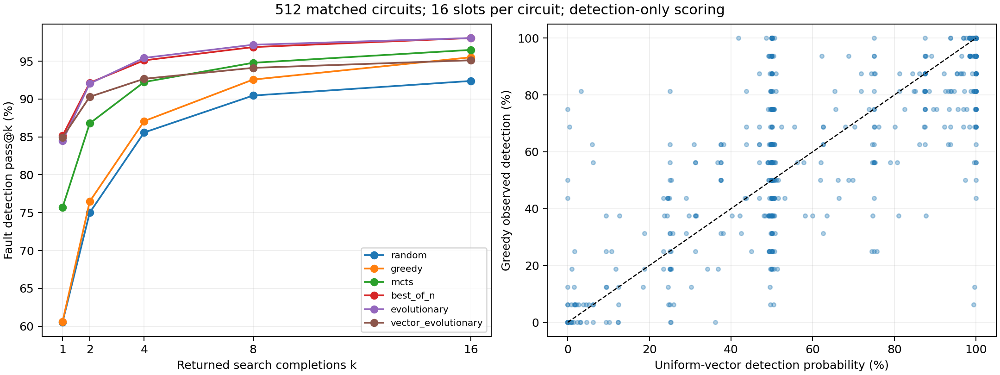

Latest follow-up (September 17): [Resolved findings and next steps](RESOLVED_FINDINGS_AND_NEXT_STEPS.md) records the completed base/SFT/GRPO comparison and independently confirmed cached training-label errors. Bus identity is corrected; strict canonical-output enforcement remains deferred at the user's request. Recommendations below describe the historical audit and should be read with that update.

[CONCERNS_VALIDATION.md](CONCERNS_VALIDATION.md) rechecks the raw metrics, independently validates three circuits, and qualifies the training-overlap finding using the checkpoint's 72-circuit GRPO exclusion manifest. The parser-defect discussion below describes the historical runs; the current worktree already contains related fixes.

**The six runs show useful structured behavior on some faults, but do not establish a general reasoning advantage or a practical advantage over cheap vector search.** Greedy and random have essentially identical aggregate single-slot detection. The evolutionary runs never reach evolution. MCTS spends its small budget on too few distinct vectors. Most model answers have incorrect expected outputs even after receiving simulation results.

This audit used the six requested W&B directories, their evaluation JSON files, saved trajectories, and the implementation at `libatpgllm` commit `f34692a`. Existing evaluator/launcher edits were left untouched. All measurements below are local calculations, not literature-derived estimates. The audit adds reports and analysis scripts only.

The matched configuration is Granite 4.2 8B GRPO checkpoint 50, `conversation-search-v1`, test split, seed 42, 512 identical problem IDs, 16 slots per problem, temperature 0.7, top-p 0.95, and one tool round. There are 512 distinct raw netlists, with 1–144 PI bits. The evaluator takes the first 512 unique netlists passing its length filter; it does not randomly sample the whole test set. The 4,096-token filter is applied to the netlist field, not the entire rendered prompt. This is one target per selected circuit, not full circuit fault coverage.

| Method / W&B ID | Pass@1 | Pass@4 | Pass@16 | Targets solved at least once | Evaluation time | Generated tokens | Simulator executions |
|---|---:|---:|---:|---:|---:|---:|---:|
| random / `johktkni` | 60.51% | 85.58% | 92.38% | 473/512 | 51.94 s | 0 | 8,192 |
| greedy / `dms52ruj` | 60.57% | 87.09% | 95.51% | 489/512 | 8.18 h | 21.59 M | 7,767 |
| mcts / `8rvdaqde` | 75.67% | 92.24% | 96.48% | 494/512 | 12.16 h | 31.20 M | 10,617 |
| best_of_n / `snqbdxoi` | 85.13% | 95.10% | 98.05% | 502/512 | 13.93 h | 35.31 M | 13,276 |
| evolutionary / `ipt1fjf7` | 84.46% | 95.43% | 98.05% | 502/512 | 14.80 h | 36.47 M | 13,267 |
| vector_evolutionary / `fkmhdl8w` | 84.92% | 92.67% | 95.12% | 487/512 | 86.85 s | 0 | 14,817 |

These are final `pass@k` values, not `running_pass@k`. The latter were last logged at 320 examples and differ from the final 512-example result. Times are observed evaluation wall times on the recorded machines, not controlled isolated throughput measurements. Simulator executions count wrapper executions, including a failed execution; simulator requests also include cache hits.

One search slot for the four search methods can contain **up to four attempts**. A greedy/random slot contains one attempt. Thus search pass@1 is not single-draw model accuracy, and search pass@16 can spend up to 64 attempts per target. Also, `greedy` here means one stochastic model trajectory: temperature 0.7 is not greedy decoding.

The seeds do not provide bitwise matched model trajectories across runs. Among 5,167 best-of-N slots returning after one attempt, all have the same slot seed as greedy, but only 1,009 have identical completion text and 4,274 have the same detection outcome. The saved data do not identify the cause; backend/batch numerical variation is one possibility. Comparisons below pair circuits, not an assumption that the first model draw was identical. Controlled reruns should freeze model/data artifacts and verify backend reproducibility.

**Random versus greedy: the near tie is real.** Greedy produced 4,962 detecting slots, versus random's 4,957 out of 8,192. Its advantage is 0.061 percentage points. A paired bootstrap over the 512 circuits gives a 95% interval of **−2.04 to +2.17 percentage points**. This is no demonstrated aggregate single-slot advantage; it is not a formal proof of exact equivalence.

The relevant probability is the fraction of detecting assignments, not the probability of guessing one specific assignment:

`p_i = number of detecting input assignments / 2^(PI bits)`.

There can be many detecting vectors. Drawing one fair bit per PI, as the implementation does, is uniform over the `2^n` possible vectors (`0` through `2^n−1`). Random PO guesses do not affect the detection-only success predicate. The verifier uses the authoritative target, circuit, and canonical outputs, not the fault claim or guessed output values, to determine detection.

I independently executed the compiled circuits with a NumPy good/faulty-machine loop. I enumerated all inputs for 213 circuits with at most 16 PI bits, and sampled 8,192 inputs per circuit for the other 299. The predicted mean uniform detection rate is **60.08%**, consistent with the recorded 60.51%. Of the 512 targets, 280 have estimated uniform detection probability above 50%; 170 target a primary output and 67 target a primary input. Large vector spaces do not make this selected fault distribution uniformly hard.

All **47,803 saved FINAL slots** across the six runs had detection labels matching the separate execution loop. All pass@k values were also recomputed from per-problem success counts. This rules out a simple aggregation mistake or universal false-positive detector. The replay shares the production netlist parser and gate truth tables; it is not independent Verilog/library validation, and the bus bug below demonstrates that limitation.

**There is structure in the model's proposals, hidden by the aggregate.** Excluding the four circuits with broken bus parsing, stratifying by independently probed random difficulty gives:

| Circuit group | Circuits | random | greedy | best_of_n | evolutionary | vector_evolutionary |
|---|---:|---:|---:|---:|---:|---:|
| Estimated uniform detection ≤10% | 44 | 2.70% | 15.34% | 31.96% | 34.38% | 9.38% |
| Estimated uniform detection >50% | 279 | 82.35% | 75.07% | 94.96% | 94.20% | 98.43% |

These are per-slot rates, with the same one-versus-four-attempt distinction. The strata come from the separate uniform probe, not from selecting the model's wins. A zero-hit Monte Carlo probe does not imply zero true detection probability.

Concrete examples: on index 227 (`equals`, `sa1 n81`), greedy succeeds 8/16 times and its detecting vector assigns identical 32-bit operands; best-of-N succeeds 12/16. On index 473 (`equals15bit`, `sa1 n31`), greedy succeeds 12/16 and best-of-N 16/16, again using matching operands. The recorded random and vector-search runs solve neither target, and neither target had a hit in the independent 8,192-vector uniform probe. These are examples of nonuniform, useful proposals, not evidence from fluent reasoning text.

However, both examples are also solved by the all-zero and all-one patterns. Across all 512 targets, all-zero detects 52.34%, all-one detects 54.10%, and **trying both detects 81.64% with at most two calls**. The two-pattern strategy solves 40.91% of the 44 hard cases. Therefore, an advantage over uniform random alone is insufficient to establish sophisticated reasoning; simple structured-vector heuristics must be included.

I also evaluated an additional offline control: **try zeros, then ones, then up to two random vectors, stopping on detection**, with 16 slots per circuit and seed 42 derived from the same problem IDs. Its measured pass@1 is **89.685%**, pass@4 **94.906%**, and pass@16 **96.680%** (495/512 targets). It uses 14,654 logical simulator evaluations and no model calls. Best-of-N's corresponding values are 85.132%, 95.103%, and 98.047%, with 13,276 recorded wrapper executions and 35.31 million generated tokens. Thus the cheap control is stronger per four-candidate search, while the model eventually reaches more targets. This control was evaluated with the separate NumPy execution loop, not the original W&B launcher; its count is a logical evaluation count, not a measured wrapper runtime. It shares the parser limitation. The independent probability estimate for this control is 89.863%, consistent with the measured 89.685%.

Greedy's pass@16 advantage over random is more substantial than its pass@1 difference: +3.125 points, with paired circuit-bootstrap interval +0.98 to +5.27 points. It solves 25 targets that random misses and misses 9 that random solves. This supports complementary behavior, subject to the parser and generalization caveats.

**The evolutionary labels are misleading at this budget.** In [the model policy](../../../atpgllm/training/search_policies.py), `attempt < min(population_size, budget)` sends every one of the four attempts through seed generation. With population size 6 and budget 4, the seed temperatures are 0.5, 0.8, 1.0, 0.5. No mutation, crossover, or feedback evolution occurs. This run is effectively simulator-selected model sampling with varying temperature.

The [vector policy](../../../atpgllm/training/sampling_strategies.py) requires at least `min(6,4)=4` existing population entries before mutation/crossover. The budget ends before a fifth attempt exists. It is effectively up to four random vector trials, with duplicate handling, simulator selection, and expected outputs copied from the simulator. Its approximately 85% detection is therefore unsurprising: random pass@4 is 85.58%, and the independent per-circuit estimate `mean(1−(1−p_i)^4)` is 85.77%. Do not substitute the overall mean p into this nonlinear formula; circuit difficulty is heterogeneous.

Best-of-N minus vector-only pass@1 is just +0.208 points, with paired bootstrap interval **−1.33 to +1.76 points**. Removing the four broken-bus circuits yields **85.581% versus 85.593%**, an even closer tie. Best-of-N does have a higher pass@16: 98.05% versus 95.12%, showing better coverage of some difficult targets after many searches, at far greater generation cost. No evolutionary-operator advantage was tested by these runs.

**MCTS is disadvantaged by this particular search horizon.** The current policy branches over complete assistant/tool actions. With four attempts, progressive widening generally produces two root alternatives and then revisits a child after its tool result. With `max_tool_rounds=1`, another simulated repair on that branch is forbidden; much of the remaining search finishes answers for an already-tested vector. Uniform priors and a non-detecting value of only 0 or 0.2 provide little additional guidance.

The diagnostic evidence is consistent with that mechanism:

| Quantity | MCTS | Best-of-N |
|---|---:|---:|
| Total attempts | 14,857 | 14,292 |
| Simulator executions | 10,617 | 13,276 |
| Mean distinct scored final vectors per slot | 1.285 | 1.598 |
| Slots consuming all four attempts | 1,777 | 1,258 |
| Four-attempt slots with only two distinct scored vectors | 1,503 | 75 |
| Four-attempt slots with four distinct scored vectors | 0 | 867 |

Distinct-vector diagnostics count scored final vectors, not every tool vector. Full candidate/tree traces were disabled, so the exact contribution of each revisited branch cannot be reconstructed. Still, the code and cost diagnostics explain why expecting MCTS to win here is unwarranted. Its pass@1 deficit versus best-of-N is **9.46 points**, with paired bootstrap interval **−10.60 to −8.31 points**. This is a result for B=4, one tool round, and these policies; it is not a general ranking of MCTS versus best-of-N.

**Detection is not a correct executable test answer.** `fault_detected` ignores whether the model reports correct expected outputs. Requiring the existing full-accuracy predicate on the same selected answers, without rerunning or reranking search, gives:

| Method | All expected output bits correct | Detecting, correct PI/PO report, target fault reported |
|---|---:|---:|
| random | 5.94% | 2.51% |
| greedy | 15.33% | 10.72% |
| mcts | 16.93% | 13.09% |
| best_of_n | 16.99% | 14.53% |
| evolutionary | 18.57% | 15.64% |
| vector_evolutionary | 99.22% | 84.92% |

The vector method gets output values from simulation, so its fidelity is not learned prediction. A `full_accuracy` search rerun could select different answers; the table measures the answers actually returned by the detection-only runs.

Several dashboard labels also require care. In [reward_funcs.py](../../../atpgllm/llm/reward_funcs.py), `input_vector_acc` measures a complete valid PI assignment, not similarity to an optimal test; `detected_faults_acc` measures mentioning the requested fault, not verified fault-set coverage; and `pred_vs_fault_sim_acc` compares a completion's simulation table against verification. In the new evaluator that table comes from the real tool and is matched to the final vector, so a high score does not show that the model predicted or copied the expected outputs correctly. Random's 100% fault-name score is obtained by mechanically inserting the target string.

The selected trajectories expose a specific failure to use feedback: **7,628 of 7,753 greedy slots with a tool observation (98.39%) report expected outputs identical to their own earlier tool-request `output_vector`**. Only 1,254 of those trajectories match every canonical output in the returned good-machine table. The analogous original-request matches are 7,918/7,981 for best-of-N, 7,885/7,939 for evolution, and 7,902/7,953 for MCTS. The fields generally preserve the pre-simulation guess rather than correct it from the observed result. This is stronger evidence of weak feedback use than a subjective reading of the generated reasoning.

**A real simulator/parser defect affects four rows.** [netlist_utils.py](../../../../data_preprocessing/netlist_utils.py) reduces bus ranges to widths and expands indices using `range(width)`. Thus `input [6:2] opcode` becomes `opcode[0]` through `opcode[4]`; `output [1:7] leds` becomes `leds[0]` through `leds[6]`. The actual circuit still references the original indices.

| Index | Circuit | Relevant declarations | Consequence |
|---:|---|---|---|
| 108 | ctrl | `fun3[14:12]`, `fun7[31:25]`, `npcop[2:1]` | Missing inputs/outputs and unresolved logic |
| 321 | controlunit | `opcode[6:2]` | Outputs, including the target, unresolved |
| 395 | top | `leds[1:7]` | Invented `leds[0]`, omitted `leds[7]` |
| 474 | msrv32_img | `instr_in[31:7]` | Unresolved output cone |

All 64 vector-only failed slots and 128 recorded infrastructure errors occur on these four circuits: the policy cannot read a complete good-output vector from the simulator. Other methods can still receive scores from partially resolved output sets. `num_errors=0` at the evaluator level therefore does not mean there were no failed slots. These rows must be corrected and reevaluated, not interpreted as intrinsically difficult or untestable circuits. Excluding them does not reverse the principal aggregate conclusions.

**The available split is not evidence of unseen-circuit generalization.** I scanned all 762,517 rows of the locally cached training split for `asap7-language-of-test-v2`, revision `d35cfea64eadf30fb3b39735b0e8d20bffcc3345`. It contains 2,848 unique raw netlist hashes. **All 512 evaluation netlists occur in that training split, and 461/512 evaluation netlist–target-fault pairs occur there too.** These are byte-identical netlists, not merely reused module names. This does not prove that every overlapping row was consumed by checkpoint 50: its exact training buffer contents and dataset revision were not reconstructed from the saved hash. It does establish substantial overlap in the available dataset and prevents treating the reported test results as proof of generalization to unseen circuits. Pattern memorization, circuit familiarity, simple structural heuristics, and transferable reasoning remain unresolved explanations.

**What would establish the model's contribution?** These six runs use one checkpoint and cannot attribute any ability to GRPO versus SFT or the base model. Useful structured proposals are demonstrated, but generalized causal understanding is not. The next decisive comparisons are:

1. Correct bus indexing and reject unresolved canonical outputs; cross-check representative results with an independently parsed simulator. Preserve the original results as a historical baseline.
2. Compare base, SFT, and GRPO checkpoints on the same circuit-disjoint faults, with renamed nets/modules and reordered gates. Include no-tool proposals and tool-assisted proposals separately.
3. Include uniform random, zeros/ones plus random, and meaningful vector evolution at equal simulator caps. Evaluate fault detection and usable-test correctness separately, alongside time and generated tokens.
4. To test evolution, leave attempts after population initialization: for example population 2 with budget 8, or population 6 with a larger budget. To test feedback/MCTS, permit multiple tool rounds and enough attempts; save full traces and count distinct simulated vectors.
5. Repeat seeds and stratify by independently measured random difficulty. Also test held-out larger circuits; this first-512, short-netlist subset cannot establish broad generalization.

The bootstrap intervals above resample matched circuits 10,000 times with seed 20260916. They describe uncertainty over this selected circuit set, not independent training runs, all hyperparameter choices, or completely independent circuit families. Difficulty probabilities are exact only for the enumerated 213 circuits. No model reruns or training changes were performed.

Reproduction artifacts: [audit.py](audit.py), [analysis.json](analysis.json), [per_problem.csv](per_problem.csv), [trajectories.py](trajectories.py), and [trajectory_analysis.json](trajectory_analysis.json). The audit script uses the production parser/gate factory without importing the model stack; its separate execution loop deliberately shares those definitions. Run it with the project's Python 3.11 environment. The trajectory script uses local Arrow cache files and can run with the system Python environment.
