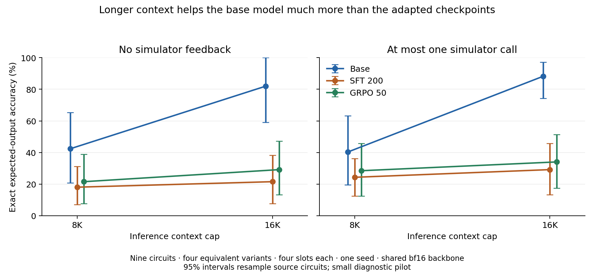

**The trained model shows useful, nonrandom ATPG behavior, but these evaluations do not demonstrate a reasoning improvement from fine-tuning. The output-correctness problem has concrete explanations beyond context length: incorrect cached training labels, contradictory simulation snapshots, and a persistent tendency to repeat an output guess instead of correcting it from feedback.**

This document records what was established by September 17, 2026, and the next experiments justified by that evidence. It uses the six original search runs, the requested SFT/GRPO training configurations, and a completed base/SFT/GRPO comparison. The future design reports were not used. Model answers and cached training labels were preserved; strict canonical-output enforcement remains deferred.

The most consequential new finding concerns the training data. A fixed Bernoulli sample of 736 cached training records yielded 91 records from 81 circuits passing the SFT prompt-length filter. All 91 could be simulated with resolved outputs. Only **43/91 stored expected-output vectors agree with the fault-free circuit for the stored named input vector**. Of the 90 examples retaining expected-output supervision under the 8K cap, **47 retain incorrect expected-output targets**. This is a sample of the cached dataset, not proof that these exact records were consumed by checkpoint 200.

| Check on the same 91 eligible cached records | Agree / 91 |
|---|---:|
| Stored expected output versus recomputed fault-free output | 43 |
| Stored Good Machine output table versus recomputed fault-free output | 53 |
| Stored Good Machine output table versus stored expected-output label | 45 |
| Stored Bad Machine output table versus recomputed faulty output | 83 |
| Stored input vector actually detects its target fault | 77 |

Thus 48 output labels are inconsistent with the simulated circuit, 38 saved good-output tables are inconsistent, and 46 records have a disagreement between their own expected-output label and saved good-output table. The simulator comparison shares production parsing and cell tables, so I independently checked three simple cached circuits from their wiring. All three confirm incorrect labels. For example, `binary_to_ascii_bin` directly connects `ascii[0]` to `binary`, ties bits 4 and 5 high, and ties the remaining bits low. With `binary=1`, the ascending-index output is `10001100`; the stored label is `00110001`, its reversal. No language-model judgment or complex gate model is needed to establish this error. Evidence and reproduction: [label probe](sft_training_label_probe.json), [sample](sft_training_label_sample.json), [independent checks](sft_label_independent_checks.json), [probe script](sft_training_label_probe.py).

**Bus value ordering is a supported explanation for much of this corruption, but its exact historical provenance is not fully reconstructed.** The dataset importer in `data_preprocessing/final_dataset_creation.py` pairs positional pattern bits with `optimized_netlist.input_nets` and `output_nets` using `zip`. Their bus expansion uses ascending indices. A retained TetraMAX STIL file explicitly orders its input and output buses from bit 31 down to bit 0. That retained file demonstrates the source-order hazard; it is not claimed as the exact source of the sampled cached records.

As a diagnostic, reversing values within both input and output buses raises agreement to **82/91**, and reversing input buses raises actual target detection from **77/91 to 90/91**. Output-only reversal gives 48/91 agreement; input-only reversal gives 42/91. These results strongly support an import-order problem. They also show that a universal reversal is insufficient: nine labels still disagree. No dataset was rewritten by this diagnostic. The previously fixed bus-*identity* issue—preserving actual nonzero, ascending, signed, and single-bit ranges—is distinct from binding positional pattern values to named bits.

The formatter compounds the problem. It places the stored expected-output label into the SFT tool request and repeats it in the final answer. Consequently, contradictory examples can reward retaining the label despite a different tool observation. Earlier descriptions of these request values as “gold” should be read as *stored targets*, not verified physical truth. This establishes inconsistent supervision and a mechanism compatible with the learned behavior; a repaired-data training ablation is still needed to measure its causal effect on the checkpoint.

**The fresh checkpoint comparison is complete.** It contains 12 jobs and 1,728 completion slots: base Granite 4.2 8B, SFT checkpoint 200, and GRPO checkpoint 50; 8K and 16K inference caps; zero or one tool round; nine circuit-disjoint faults, each in original, renamed, reordered, and jointly transformed form; four stochastic slots per form with seed 42. Every amended prompt is 890–1,537 tokens, within the SFT prompt window. No expected outputs are filled in for model answers.

All jobs passed checks for the frozen manifest, checkpoint paths, shared sampling settings, ordered problem identities, slot counts, and paired seeds. There were no infrastructure errors. Adapter fingerprints remained unchanged. A separate execution loop agrees with every scored final-output label. Hand-derived equations for three evaluation circuits agree with 463 final detection labels, 463 final-output correctness labels, and 494 tool-output tables. See the [result receipt](checkpoint_comparison_receipt.json), [full results](checkpoint_comparison_summary.csv), [diagnostics](checkpoint_comparison_diagnostics.json), and [independent evaluation checks](checkpoint_independent_checks.json).

The 16K results below count invalid or unfinished slots as unsuccessful. “Exact output” means the complete fault-free primary-output assignment for the model's chosen input, independently of whether that input detects the fault.

| Checkpoint | Tool rounds allowed | Valid final | Fault detected | Exact output |
|---|---:|---:|---:|---:|
| Base | 0 | 95.14% | 90.97% | 81.94% |
| SFT 200 | 0 | 67.36% | 53.47% | 21.53% |
| GRPO 50 | 0 | 74.31% | 60.42% | 29.17% |
| Base | 1 | 89.58% | 89.58% | 88.19% |
| SFT 200 | 1 | 78.47% | 62.50% | 29.17% |
| GRPO 50 | 1 | 92.36% | 68.06% | 34.03% |

At 16K with one tool round, the paired exact-output differences from base are −59.03 percentage points for SFT (circuit-bootstrap 95% interval −75.69 to −43.06) and −54.17 for GRPO (−72.92 to −35.42). GRPO exceeds SFT by 4.86 points, with an interval spanning zero (−4.17 to +13.19). Intervals resample nine source circuits, preserving their transformed variants; they do not account for training-seed variation, related design families, or multiple exploratory comparisons.

This is **one common bf16 serving condition with optional LoRA adapters**. The original training used NF4, and the historical six-policy evaluations used QLoRA-faithful merged serving. The current checkpoint ordering is established under the tested serving condition; attributing the entire difference to fine-tuning requires a matched NF4/dequantized-backbone control. The initial brief prompt also proved ambiguous about answer syntax and tool limits. Its completed pilot results were preserved separately, and every checkpoint received the same amended explicit instructions. This was a documented prompt amendment, not a blind preregistered experiment. Details are in [the experiment record](CONTEXT_AND_CHECKPOINT_COMPARISON.md).

**The context-window mismatch is real, but it does not explain away the output failures.** W&B records SFT at an 8,192-token sequence limit and a 2,048-token prompt filter; both GRPO runs use 16,384 and a launch prompt filter of 4,096. In the sampled SFT-eligible data, one final expected-output field falls beyond 8,192 tokens. The remaining 90 retain supervised output tokens, including the 47 incorrect targets noted above. This supports investigating training-data correctness before attributing the failure chiefly to lost supervision through truncation.

Increasing the inference cap from 8K to 16K raises exact-output accuracy with one tool round from 40.28% to 88.19% for base, 24.31% to 29.17% for SFT, and 28.47% to 34.03% for GRPO. More context primarily allows the base model to finish its longer generations. Even among valid 16K tool-enabled finals, exact-output accuracy is 98.45% for base, 37.17% for SFT, and 36.84% for GRPO. The adapted models' failures therefore extend beyond unfinished answers. Changing an inference cap does not isolate the causal effect of the SFT training cap.

**Failure to correct a wrong guess is directly measured.** Restricting to valid finals whose input equals the last simulated input makes the simulator's good outputs unambiguous. At 16K:

| Checkpoint | Wrong output guesses sent to the tool | Corrected in final answer | Wrong guess repeated |
|---|---:|---:|---:|
| Base | 43 | 43 | 0 |
| SFT | 72 | 5 | 67 |
| GRPO | 84 | 4 | 80 |

These are conditional counts from different model-generated trajectories, not identical injected-error trials. Nevertheless, the behavior persists in short histories: with reconstructed full conversations at most 7,680 tokens, SFT repeats 62/67 wrong guesses and GRPO repeats 71/75. One GRPO example detects the fault but repeats two wrong output bits after receiving the correct table; its complete reconstructed history is only 2,581 tokens. This rules out direct context overflow for that example. See [feedback/context evidence](checkpoint_feedback_context.json).

The training objective is also relevant, but output accuracy is not entirely absent from it. The checked GRPO code uses normalized priorities detection 1.0, activation 0.25, fidelity 0.20, and format 0.05; fidelity is detection multiplied by output agreement. Exact-output and tool-table-consistency diagnostics are logged separately. Detection-only search acceptance can therefore report a successful test even when its expected output is wrong. The observed repetition is consistent with inconsistent SFT supervision plus a detection-prioritized objective; their separate causal contributions have not been measured.

**Renaming and reordering do not rescue the intelligence claim.** At 16K with one tool round, exact-output accuracies are:

| Checkpoint | Original | Renamed | Reordered | Both |
|---|---:|---:|---:|---:|
| Base | 91.67% | 94.44% | 77.78% | 88.89% |
| SFT | 38.89% | 33.33% | 25.00% | 19.44% |
| GRPO | 36.11% | 36.11% | 30.56% | 33.33% |

GRPO's similarly low scores across variants show no large renaming collapse in this pilot; they do not establish robust invariance or reasoning. Transformations change prompt-derived sampling seeds, so these contrasts include sampling variation. Four circuits have constant observed outputs. On the five with varying outputs, 16K no-tool exact accuracy is 70.00% for base, 11.25% for SFT, and 12.50% for GRPO; with a tool it is 85.00%, 12.50%, and 17.50%. The base advantage is not solely a constant-output effect. These five circuits remain a very small diagnostic subset.

The original random-versus-greedy tie has a separate, resolved explanation. Success means finding *any* detecting vector, not guessing one special n-bit vector. The measured fault distribution predicts about 60.08% uniform-random detection, close to the observed random 60.51% and greedy 60.57%. The paired greedy advantage is only 0.061 points, with a 95% interval of −2.04 to +2.17. Cheap constants-plus-random search is also strong. The prior audit independently verified some useful model-chosen sensitizing patterns, but their strongest evidence concerned primary-input faults; it did not demonstrate a fine-tuning benefit or sophisticated general circuit reasoning. Full evidence is in [the six-run validation](CONCERNS_VALIDATION.md).

The defensible capability claim is therefore limited: the trained policy can make useful structured proposals, and it has learned aspects of the task protocol, but reliable circuit-output prediction, reliable feedback correction, and an advantage attributable to fine-tuning remain unvalidated. Incorrect supervision makes a blanket conclusion that the model has “no intelligence” especially unjustified. It also makes claims of successful learned ATPG reasoning premature.

The next steps should be performed in this order:

1. **Repair and validate data provenance before retraining.** Bind pattern positions to the source STIL signal-group order, preserve that mapping, and check exact widths and names. Regenerate input assignments, expected outputs, and snapshots together; validate them with an independent circuit engine. Investigate the nine records not explained by bus reversal and the corrupted snapshot tables. Reconstruct the actual SFT/GRPO dataset revision and consumed buffers where possible. This analysis has not rewritten the corpus or installed a blanket reversal.
2. **Remove the serving confound.** Repeat the frozen checkpoint comparison using the same NF4 or dequantized NF4 backbone for base and both adapters. Preserve explicit instructions and raw outputs. This determines whether the current checkpoint gaps survive the serving condition used in training.
3. **Test feedback correction directly.** Give all checkpoints identical prefixes with deliberately wrong output guesses and correct simulator observations. Measure correction on short and long prefixes. Then compare SFT on validated targets with and without examples that teach correction after a wrong request. This separates feedback use from each model's proposal distribution.
4. **Isolate training context length.** Compare 8K and 16K SFT on the same validated eligible records, same training-token accounting, and replicated seeds. Separately vary prompt eligibility; then apply matched GRPO. Compare reporting fidelity objectives independently of detection rewards. Increasing the cap alone is not a data repair.
5. **Test transferable capability on a larger frozen benchmark.** Obtain genuinely new circuit families; this cache yielded only nine eligible structurally disjoint circuits. Use multiple fault difficulties and evaluation seeds, matched candidate/simulator budgets, and uniform random, constants-plus-random, and simple fault-aware controls. Report proposal quality, valid-final rate, exact outputs, and feedback correction separately. More faults on the same nine circuits do not create more independent circuits.

Work completed includes the bus-identity correction, the 12-job checkpoint comparison, artifact/pairing validation, output and feedback diagnostics, independent Boolean checks, and the sampled label audit. The remaining work is dataset repair and controlled causal experiments, not further inspection of the same aggregate detection score.
