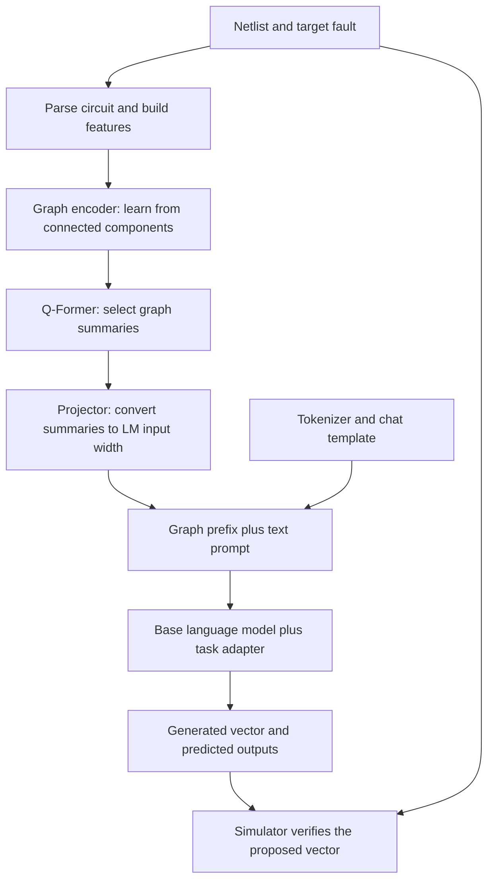

# Graph modality: implementation, integration, goals, and next steps

Original implementation review and CPU probes: **2026-09-19**. Expanded report
drafted **2026-09-20** and completed **2026-09-25**. All 41 files in the original
source manifest were checked again on September 25 and still match their recorded
hashes. Results below are from the original probes; they were not rerun for this
documentation update. Training code and existing runs were not changed.

**Main conclusion:** a graph can be connected to an already trained language
model. The current implementation has a working connection, but loses some circuit
information before the language model receives it. It also needs fixes in training,
loading, and evaluation. Repair these foundations before a large training run.
Improved fault detection remains an expected benefit to test.

## 1. What we want to achieve, and why

Automatic test pattern generation (ATPG) asks: **which input values will expose a
particular circuit fault at an observable output?** The answer depends on exact
connections, gate functions, the fault location, and input/output signal names.
Recognizing the circuit's general purpose is not enough.

A text-only model reads a netlist as a long sequence of words and symbols. A graph
provides another representation: components and their connections. It does not
automatically add new facts. Its expected benefit is to make circuit relationships
easier for the model to learn and use.

| Goal | Reason | Evidence needed |
|---|---|---|
| More correct test vectors | Fluent explanations do not prove fault detection. | Better simulator-confirmed detection on unseen circuits. |
| Preserve exact circuit meaning | Different pin connections and Boolean functions can require different vectors. | Functionally different circuits remain distinguishable in the graph input. |
| Reduce dependence on long netlist text | Large circuits consume the model's limited input space. | Compact graph inputs preserve detection quality while reducing text length. |
| Preserve the trained task model | The checkpoint already contains useful ATPG training. | Original behavior works when the graph is bypassed, with acceptable retention after adaptation. |
| Practical runtime and memory | Shorter text can still require an expensive graph encoder. | Measure complete generation time, GPU memory, and throughput. |
| Support another modality later | Future input types should reuse the integration work. | A common input interface and a measured benefit beyond text plus graph. |

These are goals, not measured improvements. The immediate deliverable should be
an accurate circuit representation and a reliable bridge into the chosen trained
checkpoint. Accuracy and efficiency comparisons follow those foundations.

## 2. How the implementation works

A **modality** is an input representation, such as text, a graph, or a waveform.
An **embedding** is a list of learned numbers representing an input. A **checkpoint**
stores learned weights and loading information. A **LoRA adapter** stores a small
set of learned changes to a larger base model; it normally needs that base model
to run.

The graph becomes a short sequence of numerical inputs called a **soft prefix**.
These inputs have the same width as the language model's word embeddings, but do
not have to correspond to readable words.



During supervised training, the recorded answer is also supplied so the model can
learn to predict its next token. During generation, it receives the graph and
prompt and produces its own answer. The simulator checks the original circuit and
proposed vector; it does not simulate graph embeddings.

### Parse the netlist: identify the connections

Files: [netlist_parser.py](../atpgllm/graph/netlist_parser.py) and
[dataset.py](../atpgllm/graph/dataset.py).

**What:** reads Verilog gates and connected nets. It currently creates one node per
gate and an edge from a driving gate to a gate that reads its output. It computes
depth and connection counts as additional features.

**Why:** the network needs a structured description before learning from connections.
**Expected result:** the graph describes the same circuit as the simulator. This
is the largest current gap: pin roles, primary input/output mapping, constants,
and some logic distinctions are lost. Depth is a structural hint, not a calculation
of whether a particular fault can be detected.

### Build features: describe the gates and target fault

Files: [gate_features.py](../atpgllm/graph/gate_features.py),
[fault_context.py](../atpgllm/graph/fault_context.py), and
[node_encoder.py](../atpgllm/graph/node_encoder.py).

**What:** describes logic family, input/output count, and whether a gate stores
state. Fault features mark gates that drive or read the target net and whether the
fault is stuck at zero or one. The node encoder converts these into learned numbers.

**Why:** the same circuit can have many faults. The input must describe both the
circuit and the particular question. Sharing attributes across similar gates can
help learning, but must not merge different Boolean functions.

Propagation paths, backtracking paths, and good/bad simulation differences are
attached as teaching labels. The inference encoder does not consume them as input.
This useful separation prevents the graph encoder from receiving the answer it is
supposed to predict.

### Run the graph encoder: learn from neighboring gates

Files: [dag_gin.py](../atpgllm/graph/dag_gin.py) and
[models_stage1.py](../atpgllm/graph/models_stage1.py).

**What:** repeatedly combines each gate's representation with connected gates. It
processes both upstream gates that help set a signal and downstream gates through
which a fault might become observable. It combines representations from several
layers to retain information about different neighborhood sizes.

**Why:** a gate type alone cannot describe how to control or observe it.
**Expected result:** useful information about the surrounding circuit. A finite
number of layers only spreads information a finite number of connections. This
network is not an exact simulator; its depth does not guarantee whole-circuit
reasoning.

### Run the Q-Former: select a short set of graph summaries

File: [models_stage1.py](../atpgllm/graph/models_stage1.py), `GraphQFormer`.

**What:** learned query vectors attend to graph nodes and produce a fixed number
of summaries. These queries are trainable numerical slots, not natural-language
questions. Padded nodes are masked so they do not count as real circuit components.

**Why:** the language model should not need one extra input position per gate.
**Expected result:** a short set of useful graph tokens. Compression may lose a
connection essential to a fault. More query tokens offer more capacity but consume
more memory and input positions; choose their number through evaluation.

Current queries receive fault information through the node features, not directly
through the user's text. Dedicated local-fault and whole-circuit summaries are
proposed improvements, not existing features of this Q-Former.

### Run the projector: make graph summaries usable by the language model

File: [multimodal/model.py](../atpgllm/multimodal/model.py), `graph_to_llm`.

**What:** a small neural network converts each graph summary to the language model's
input width. The wrapper matches numeric type and device, then places projected
graph tokens before the text embeddings.

**Why:** the networks use different numerical representations. Matching width makes
the connection possible, but does not make graph tokens meaningful. The bridge
must be trained with the chosen language model.

The prompt's `<GRAPH_CONTEXT>` marker is only a textual placeholder. The actual
graph information enters through the numerical prefix. A marker or circuit hash
on its own does not supply the circuit's topology.

### Train and generate through the language model

Files: [multimodal/data.py](../atpgllm/multimodal/data.py),
[multimodal/model.py](../atpgllm/multimodal/model.py), and
[multimodal_training.py](../scripts/train/multimodal_training.py).

**What:** the language model predicts answer tokens from graph and text inputs.
Only answer positions contribute directly to supervised loss; graph and prompt
positions are excluded from that score.

**Why:** the output remains a test vector and answer in the task's text format.
Answer errors can still send learning signals backward through the model into the
prefix, projector, and trainable graph components. The CPU probe confirmed this
path with a small real causal language model.

A frozen language model can still pass gradients back to the bridge. Freezing its
weights is different from wrapping its whole computation in `no_grad()`: the latter
would stop bridge learning through that computation.

### Verify the answer independently

File: [reward_function_factory.py](../atpgllm/training/reward_function_factory.py).

**What:** retrieves the original netlist from the record, checks its identifier,
and evaluates proposed vectors using the selected simulator.

**Why:** confidence and fluent text are not proof of detection. The complete netlist
can be removed from the prompt while still being supplied separately to the
verifier. Simulation can guide learning, but cannot reconstruct distinctions that
the model's graph input has discarded.

## 3. The four existing training stages

SFT means **supervised fine-tuning**, or learning from example answers. GRPO is the
reinforcement-learning method used here: it compares generated answers for the
same prompt using their rewards. A fixed reference model helps constrain changes
to the policy during training.

| Stage | What it does | Reason | What it does not prove |
|---|---|---|---|
| A — Graph pretraining | Trains the encoder on propagation, backtracking, and good/bad simulation labels. | Give it ATPG-related starting features. | Exact simulation from circuit and fault alone; some labels also depend on the applied vector. |
| B — Graph/text alignment | Trains graph summaries against text using similarity, matching, and generation objectives. The encoder's weights are frozen by default. | Encourage summaries related to useful descriptions. | Alignment with the selected Granite model; this stage uses a separate text encoder. |
| C — Multimodal SFT | Learns example answers with graph prefixes. By default it updates the graph stack, projector, and LM adapter together. | Teach the model to use graph information for ATPG. | Better held-out detection or preservation of earlier text-only ability. |
| D — Multimodal GRPO | Generates answer groups, scores them, and updates the policy. | Favor answers with better rewards. | Correct probability calculations, practical runtime, or generalization without separate checks. |

Stage B's objectives have different purposes:

| Objective | Plain-language question | Limitation to address |
|---|---|---|
| Contrastive learning, GTC | Is a graph closer to its paired text than to other texts? | Equivalent examples should not automatically count as wrong matches. |
| Matching, GTM | Do this graph and text belong together? | Shifting a one-example batch labels the same pair both correct and incorrect. |
| Graph-grounded generation, GTG | Can a small decoder predict text from the graph summary? | It receives one averaged vector and is separate from the task language model. |

The current Stage C loader requires a Stage B checkpoint. The proposed workflow
should make that extra alignment stage optional and compare it with direct bridge
training. Its cost is justified only if it improves the final task. Graph-only
pretraining should also be compared with training the encoder from scratch.

## 4. Extending a trained checkpoint under `runs/`

The inspected example, `runs/sft_granite_4.2_8b_repaired/checkpoint-90`, contains a
LoRA adapter, tokenizer, and chat template. It needs the corresponding base model,
`ibm-granite/granite-4.2-8b`. Its adapter rank is 32 and alpha is 64. Step 90 is an
example input, not an evaluation-based selection of the best checkpoint.

```text
Existing task model = matching base weights + trained task adapter
                      + checkpoint tokenizer and chat template

Graph extension     = existing task model + graph encoder
                      + Q-Former + trained graph-to-LM projector
```

The base revision, adapter settings, token IDs, and chat template must match.
Loading the LM adapter alone does not load the graph extension. Loading only the
graph encoder does not teach the LM to understand it. Save, load, and evaluate the
complete system together.

Start bridge training with the existing task model fixed, separate output paths,
and fresh optimizer state. This preserves the starting weights and makes the graph
contribution easier to measure. A prefix intentionally changes the input, so frozen
weights do not guarantee unchanged answers with the prefix present. Check the
original behavior through a true graph-disabled path.

The current script does not fully support this workflow. Its defaults use Qwen,
its tokenizer comes from the base-model argument, and its optimizer requires
trainable LM parameters. Supplying an existing adapter continues training that
adapter rather than freezing it while learning only the bridge.

If a later phase adds a modality LoRA, preserve the task adapter's contribution.
Use a validated combination of both adapters, or merge the task adapter into an
isolated floating-point base before quantization. Simply switching active adapters
can remove the previously trained task behavior. Quantized merges need their own
compatibility and numerical checks.

## 5. What BRIDGES supports, and where the code differs

The supplied [BRIDGES PDF](../../docs/papers/bridges.graph.modality.pdf),
arXiv:2504.05180v1, studies retrieval, circuit classification, descriptions, and
power/area estimation. This supports investigating graph inputs, but does not
establish correct ATPG vectors or exact fault detection.

| Part | BRIDGES | Current code | Reason the difference matters |
|---|---|---|---|
| Q-Former input | Pools node states with mean, max, sum, and min first. | Attends to individual node embeddings. | May retain local detail, but cost grows with node count and query count. |
| Graph/text training | Shared Q-Former processing, including text/query interaction. | Separate ModernBERT text encoder and graph summaries. | Alignment there does not establish that Granite understands the summaries. |
| Matching | Interacting representations and hard negatives. | MLP on separate representations and cyclic negatives. | Different learning behavior and potentially contradictory pairs. |
| Graph-grounded generation | Graph queries participate in shared query/text processing. | Separate decoder receives one averaged vector. | More graph information is compressed before generation. |

These differences need their own evidence; they are not automatically errors.
Comments claiming BRIDGES uses this code's per-node attention are incorrect.
Copying the paper exactly is not the goal either: ATPG needs detailed fault-specific
information that a description task may not require.

Primary references: [BRIDGES](https://arxiv.org/abs/2504.05180) and
[BLIP-2](https://arxiv.org/abs/2301.12597). BLIP-2 provides precedent for learning
a bridge into a frozen LM, not evidence of ATPG accuracy.

## 6. Problems to fix, ordered by importance

“Confirmed” means demonstrated by a recorded CPU probe or visible directly in the
reviewed code. Proposed improvements still need evaluation.

### 1. Preserve the circuit's actual meaning

**Problem:** different functions can become identical graph inputs. Enabled gate
attributes merge MAJ with MAJI and AO211 with AO22. Edges omit pin roles, output-pin
identity, primary input/output mapping, constants, and net identity. Debug ID fields
are not consumed by the encoder. Different PI faults feeding the same gate can
also receive identical fault features.

**Why this blocks progress:** larger networks and longer training cannot recover
distinctions removed before encoding.

A confirmed example is `y=(a AND b) OR c` versus `y=(a AND c) OR b`. With
`a=0, b=0, c=1`, the first gives `y=1`, exposing an output stuck at zero. The second
gives `y=0`, so the vector does not expose that fault. Their graph tensors and
prefixes are identical. Other text might supply clues and hashes might support
memorization, but neither repairs the missing graph distinction.

**Next change:** preserve nets, primary inputs/outputs, constants, Boolean function
identity, and typed pin connections. Equivalent drive variants may share features
when their relevant logic is identical. Keep a stable name/bit-order map between
graph entities and generated vectors. Mark faults on actual nets or pins, with
explicit whole-net versus fanout-branch meaning.

**Expected result:** the tested functions and fault sites remain identifiable.
Initially keep netlist text alongside the graph; test replacement only after the
graph and name mapping work correctly.

Sources: `gate_features.py:82`, `netlist_parser.py:397`, `models_stage1.py:301`,
`fault_context.py:115` under `atpgllm/graph/`.

### 2. Make parsing faithful and failures visible

**Problem:** `input [7:4] a` becomes `a[0]` through `a[3]`. Header port declarations
are not reliably parsed. An alias such as `assign t=n` can remove a connection.
Unsupported syntax and feedback cycles lack a clear validation policy. Unknown
cells use guessed output pins; broad exception handling silently skips records.

**Why:** the graph and simulator must describe the same circuit. An explicit error
is preferable to training on a plausible but incomplete representation.

**Next change:** define supported Verilog and normalize it with a validated parser
or elaborator. Check aliases, constants, actual bus indices, escaped names,
multi-output cells, and sequential/scan boundaries. Compare connectivity with the
simulator representation. Reject unsupported semantics and count the reasons.
Do not assume every synthesized circuit is a combinational DAG. The documented
cycle-depth fallback must be implemented or its description corrected.

**Expected result:** every accepted example has a faithful graph; rejected records
have an explainable reason.

Sources: `netlist_parser.py:144,193,297`, `dataset.py:266` under `atpgllm/graph/`.

### 3. Make frozen components stable

**Problem:** freeze policies disable weight gradients but leave graph modules in
training mode. Dropout remains random and BatchNorm keeps updating statistics.
The probe found changing buffers and prefixes with zero trainable encoder weights.
A one-gate training graph also fails in BatchNorm.

**Why:** frozen should mean a stable transformation. GRPO recomputes prefixes for
generation and probability scoring, so random differences can make a fixed policy
appear to change. The reference graph is in evaluation mode, making equal initial
weights insufficient to guarantee equal behavior.

**Next change:** set modes per component, including after a parent calls `train()`.
Keep frozen modules in evaluation mode. Make generation/scoring deterministic for
a fixed policy while allowing gradients in the learning pass. Consider per-node
LayerNorm in the revised encoder.

**Expected result:** unchanged frozen weights and buffers, repeatable prefixes,
consistent probabilities before updates, and support for one-node graphs.

Sources: `atpgllm/multimodal/model.py:41,157`, `atpgllm/graph/dag_gin.py:44`,
`atpgllm/graph/train_stage1.py:229`, `scripts/train/multimodal_training.py:540`.

### 4. Load and save the complete intended model

**Problem:** the script loads the tokenizer from `--llm`, records CLI LoRA settings
even when the loaded adapter differs, and cannot train only the bridge with the LM
frozen. Graph and adapter files are separate; saved adapter paths are absolute.

**Why:** matching tensor shapes is not enough. Loading, moving, or evaluating a
checkpoint must preserve the intended model and graph path.

**Next change:** one loader should validate the base revision, actual adapter
settings, tokenizer/template, graph schema, vocabulary, and dimensions. Allow an
optimizer with only bridge parameters. Save a portable bundle with relative paths,
component hashes, and reload information. Use the same loader for evaluation.

**Expected result:** baseline behavior matches before adding a graph, and complete
multimodal behavior matches after relocation and reload.

Sources: `scripts/train/multimodal_training.py:129,214,245,322` and
`scripts/train/configs/multimodal_sft.conf`.

### 5. Use one answer format and a complete length budget

**Problem:** Granite's saved template opens `<think>` in the generation prompt;
the graph path appends an answer that opens it again. Joining raw assistant
messages does not guarantee the established chat format. Long targets can remove
the question or lose their final vector/EOS token. Length limits omit the prefix.

**Why:** training and inference must agree on where answers start and end. Every
modality token uses an input position, and incomplete targets teach the wrong task.

**Next change:** use the saved template and supported assistant-turn structure to
build the answer and loss mask. Check thinking tags and stop tokens. Enforce
`all modality tokens + prompt + answer <= model context limit`. Reject or
restructure oversized records while preserving the task and complete vector.

**Expected result:** valid answer boundaries, complete targets, and matching
training/inference formats.

Sources: `atpgllm/graph/dataset.py:179`, `atpgllm/graph/stage2_model.py:201`, and
the inspected checkpoint's `chat_template.jinja`.

### 6. Repair and speed up GRPO before scaling

**Problem:** generation recomputes the full growing sequence for each token instead
of reusing earlier attention state with a KV cache. Sampling uses temperature-scaled
logits while scoring does not; non-unit temperature needs an explicit behavior-policy
contract. The loss uses a geometric-mean token ratio per answer, which differs
from tokenwise clipping and a complete answer likelihood ratio.

**Why:** updates need a defined relationship to the policy that generated the
samples. Long answers and multiple generations also make full recomputation costly.

**Next change:** define and test the RL objective and temperature treatment; use
stable float32 probability/KL calculations. Add cached generation with an uncached
parity check. Keep a differentiable prefix calculation for training. Support stop-token
lists and distinguish complete from truncated answers. Reuse required reward
diagnostics, simulator provenance, and fixed evaluation from the main stack; add
tool continuation if the task requires it.

**Expected result:** matching generation/scoring behavior, a fixed reference policy,
and measured runtime improvement. With one update on fresh samples, clipping starts
near a ratio of one; it does not itself guarantee a small update.

Sources: `atpgllm/multimodal/model.py:126`, `atpgllm/multimodal/grpo.py:20`,
`scripts/train/multimodal_training.py:445`.

### 7. Make early objectives teach useful information

**Problem:** shifted matching pairs can give contradictory labels for singleton
batches and equivalent examples. Gradient accumulation does not enlarge a single
contrastive comparison batch. Per-design captions also omit fault conditioning
used elsewhere.

Some propagation/simulation labels depend on the applied vector, but Stage A only
receives circuit and fault. Those heads can learn tendencies, not a unique trace
for every vector. Label handling also confuses valid empty paths with missing
labels, and compares unknown values without an explicit known-binary mask.

**Why:** lower loss does not guarantee better ATPG. A prediction task needs the
necessary inputs, and equivalent examples should not be treated as wrong matches.

**Next change:** define example identity and label availability; exclude equivalent
negatives or allow multiple positives. Treat circuit/fault-only trace predictions
as heuristics, or supply the applied vector/state for vector-conditioned tasks.
Do not supply ground-truth traces as inputs when generating that vector. Compare
optional text alignment against direct bridge training. If generation alignment
is retained, test using all query summaries instead of one averaged vector.

Reject Q-Former settings without a graph-attention layer. One layer with an interval
of two ignored the graph in the probe. The default six-layer setting does not have
that particular problem.

**Expected result:** consistent targets, actual use of the graph, and evidence that
extra training stages justify their cost.

Sources: `train_stage1.py:72`, `losses_stage1.py:21`, `dataset.py:380,450`,
`pretrain.py`, and `fault_context.py` under `atpgllm/graph/`.

### 8. Evaluate the full system and define reproducible resume

**Problem:** the multimodal entrypoint does not use the design split manifest or
schedule graph-aware fixed evaluation. The existing evaluator does not load the
graph bundle. HPO has useful design-hash splits, but text hashes alone do not group
renamed/resynthesized versions of one source design.

Resume restores weights, optimizer, and step, but restarts the shuffled stream
without restoring its cursor, shuffle buffer, and random states. Finite streams
can end before `max_steps`; partial accumulation is discarded. A run resumed at
the step limit still enters the loop before checking that limit.

**Why:** evaluation must test what was trained on genuinely held-out circuit groups.
A resume must either be reproducible or clearly described as a restart reusing
weights and optimizer state.

**Next change:** share fixed grouped splits across stages; evaluate full bundles.
Restore necessary data/random state and handle step limits, finite-data epochs,
and incomplete accumulation explicitly.

**Expected result:** credible detection measurements and reproducible experiments.

Sources: `scripts/train/multimodal_training.py:370,524`,
`atpgllm/graph/checkpoints.py:85`, `atpgllm/graph/hpo/splits.py`, and
`scripts/eval/evaluate_model.py`.

## 7. Recommended architecture and integration approach

Retain **encoder -> Q-Former -> projector -> language model**. Repair information
loss and make training/loading behavior explicit. Preserve the useful existing
label separation, padding masks, answer-only loss, vocabulary checks, and separate
GRPO reference graph modules.

Start with explicit pin connections and a shared symbol table for names and bit
order. Keep the fault and interface names in text. Retain the netlist initially;
replace it only after controlled experiments show that the graph is sufficient.

Compare a simple pooling/projector baseline with the Q-Former. Test query budgets
such as 16/32/64/128 as experiment choices, not known optimal settings. Consider
separate summaries for the fault's nearby logic and the whole circuit. Large
circuits may need regions or retrieved subgraphs, but omitted side inputs and
reconvergent paths must remain accounted for.

Begin with the task LM frozen. Freeze a useful repaired pretrained encoder initially;
a new encoder needs its own training or a controlled joint-training comparison.
Then selectively unfreeze components if the simpler approach is insufficient.
Give bridge and pretrained parameters separately tunable learning rates. Measure
prefix scale relative to word embeddings; final LayerNorm is not proof of the
right scale for Granite.

### A third modality

Each modality should return numerical tokens, a mask marking valid positions, a
modality type, and alignment metadata. The metadata connects entities or times to
the same circuit signal IDs and records source/schema versions. A shared sequence
assembler controls total length, positions, and loss masks. Replace offsets
currently hardcoded to graph `num_queries`.

| Possible input | Expected contribution | Essential requirement |
|---|---|---|
| Traces or waveforms | Behavior under known stimuli over time. | Signal/time alignment and availability at prediction time. Do not use an unknown target vector's future trace to generate that vector. |
| RTL or another circuit graph | Higher-level structure or another design view. | Verified mapping to netlist entities. |
| Layout or circuit imagery | Physical relationships relevant to the chosen task. | Circuit-entity alignment and evidence that physical information helps the task. |

The third modality has not been chosen. Start with its own encoder and bridge,
keeping established components fixed. Compare text, text+graph, text+third, and
all three. Add complex interactions only if the simpler combination is insufficient.
Extra input is not automatically complementary information.

A disabled modality must actually bypass its prefix. Zero-valued tokens still
change positions and attention and do not guarantee text-only equivalence.

### Efficiency after correctness

| Change | Reason | Condition |
|---|---|---|
| Cache parsed topology | Many faults reuse one netlist. | Key by netlist, parser/schema, and library versions; attach faults separately. |
| Cache encoder outputs when valid | Avoid repeated encoding. | Encoder state and conditioning must be fixed. A netlist-only cache is wrong for fault-dependent embeddings. |
| Batch similar graph/text sizes | Reduce padding cost. | Preserve masks and example correspondence. |
| Add KV-cached generation | Avoid repeated full-prompt computation. | Verify parity with uncached generation. |
| Score only needed output positions | Reduce unnecessary vocabulary-sized calculations. | Preserve answer likelihoods and masks. |
| Consolidate the two graph/LM wrappers | Avoid divergent behavior. | Cover projection, dtype, generation, and checkpoint differences first. |

The older `Stage2GraphTextLM` and newer `GraphConditionedCausalLM` differ in these
details. Validate on one GPU first. `device_map=auto` is not a substitute for an
explicit distributed training strategy.

## 8. Next steps and completion criteria

These phases are the proposed work order, not the existing A/B/C/D stage names.

| Order | Work | Reason | Complete when |
|---|---|---|---|
| 1. Establish the starting model | Select a checkpoint using fixed evaluation; implement one loader and graph-disabled path; use separate outputs. | Preserve a known baseline. | Text-only logits/greedy outputs match under the same settings and metadata matches the checkpoint. |
| 2. Repair circuit inputs | Version the schema; fix parsing, pin/function/fault representation, and name mapping. | Learning cannot repair missing inputs. | Confirmed collisions disappear, connectivity matches the simulator on supported examples, and rejections are reported. |
| 3. Repair training contracts | Fix frozen modes, single-node handling, chat format, token budget, and bridge-only optimization. | Make training behavior well-defined. | Frozen state is stable, targets are complete, and gradients reach only intended components. |
| 4. Prove small-task bridge learning | Fit a small diverse set with a real LM; compare correct and wrong graph inputs. | Show the bridge can use the information. | Learning succeeds and controls show meaningful graph use. This alone is not generalization. |
| 5. Compare SFT variants | Compare text-only continuation, text+graph, and compact graph inputs on fixed unseen circuit groups. | Separate modality gains from extra training and memorization. | Detection, retention, and cost justify the added graph path. |
| 6. Improve inference and pilot RL | Validate cache, probability/reference behavior, full reload, fixed evaluation, and resume; then pilot GRPO. | RL should start from a useful, reliable SFT model. | Correctness checks pass and a bounded pilot improves the selected held-out outcome. |
| 7. Add the chosen third modality | Implement the shared interface and an additional encoder/bridge. | Test complementary information using the same integration. | It improves beyond text+graph and handles absent/wrong modalities correctly. |

Schema changes require explicit checkpoint compatibility decisions. Do not silently
load an old encoder as though it learned the new inputs. Reuse only components
whose meaning and shapes remain valid, and retrain incompatible components.

## 9. How to judge success

Use the same starting checkpoint and circuit-group split. Keep generation settings
comparable, match training budgets where possible, and report token usage and total
compute. Choose acceptable detection/retention/cost thresholds before selecting a
winner. This report does not invent improvement targets or predict accuracy gains.

| Comparison | Question answered |
|---|---|
| Original text-only checkpoint | What performance already exists? |
| Continued text-only SFT with matched budget | Would extra training explain the gain? |
| Text plus correct graph | Does the graph add value while original text is retained? |
| Compact interface text plus graph | Can it replace much of the netlist text? |
| Missing, shuffled, and wrong-fault graph controls | Is the correct graph actually used? |
| Pooling versus Q-Former | Is the more complex summary network worth its cost? |
| Graph/text alignment on versus off | Does Stage B improve the final task? |
| Third modality with/without graph | Does it add information beyond the graph? |

Report target-fault detection, valid signal/vector mapping, expected-output
consistency, parsing and incomplete-answer rates, text-only retention, latency,
GPU memory, and throughput. Break results down by circuit size, depth, reconvergence,
and fault type. Use multiple seeds and uncertainty estimates grouped by circuit.
Keep a final test set separate from model selection.

For native TetraMAX evaluation, pin backend and fault-mapping settings and preserve
the verifier's distinction between definite detection and unknown/unavailable
results. Evaluate the complete graph bundle, not only the LM adapter. No licensed
simulation or production GPU pilot was performed for this review.

Essential regression checks:

- Teaching-label changes must not change inference inputs.
- Real answer loss must send gradients through the prefix to trainable components.
- Frozen weights and running statistics must remain unchanged.
- Cached/uncached generation must agree within the chosen numerical tolerance.
- Generation and scoring must obey the defined policy contract.
- One-node graphs, variable modality lengths, padding, and EOS budgets must work.
- Bundle relocation/reload must preserve behavior.
- Interrupted/resumed training must preserve its declared next-step behavior.
- Graph-disabled inference must reproduce the appropriate text-only baseline.

## 10. Evidence, reproduction, and limits

Artifacts: [probe script](../analysis/graph_modality_review_20260919/probe.py),
[results](../analysis/graph_modality_review_20260919/probe_results.json),
[test output](../analysis/graph_modality_review_20260919/pytest_results.txt), and
[source manifest](../analysis/graph_modality_review_20260919/source_manifest.json).

| Original probe | Observed result |
|---|---|
| MAJ/MAJI and AO211/AO22 | Identical enabled feature vectors. |
| AO21 pin-role swap | Identical graph tensors and prefixes; maximum prefix difference 0.0. |
| Input fault a versus b on that gate | Identical consumed graph tensors. |
| `input [7:4] a` | Incorrectly returned `a[0]` through `a[3]`. |
| Header with three input declarations | Only `a` returned as input. |
| Gates joined through `assign t=n` | No gate-to-gate edge produced. |
| Frozen encoder | Zero trainable encoder parameters, but 15 changed BatchNorm buffers and prefix difference about 0.144. |
| One-gate graph during training | BatchNorm raised ValueError. |
| Tiny real causal decoder | Finite loss 3.4415; nonzero projector/encoder gradient sums about 1.428/1.342. |
| Oversized answer | Entire prompt and final EOS could be dropped. |
| One-example matching batch | Identical pair labeled both correct and incorrect. |
| One Q-Former layer, cross-attention interval two | Different node inputs produced identical outputs. |
| Granite tokenizer and graph renderer | Prompt and appended answer both opened `<think>`. |
| Existing tests with writable cache | 16 passed; 1 Optuna-dependent test deselected. |

The AO21 counterexample follows its Boolean truth table; it was not run through a
licensed simulator. Prefix equality was measured in evaluation mode, separating
information loss from training randomness. Tiny-model gradients prove a learning
path, not production accuracy.

The initial test attempt encountered a read-only default PyG cache and missing
optional `optuna`. The successful rerun used a writable cache and excluded only
the Optuna-dependent mock study. These environment failures are separate from
implementation findings.

Run from the `atpgllm/` repository root:

```bash
PYTHONPATH=. PYG_HOME=/tmp/graph-review-pyg HF_HUB_OFFLINE=1 \
TRANSFORMERS_OFFLINE=1 OMP_NUM_THREADS=1 MKL_NUM_THREADS=1 \
OPENBLAS_NUM_THREADS=1 MPLCONFIGDIR=/tmp/graph-review-mpl \
/work/cxv200006/myenv/bin/python analysis/graph_modality_review_20260919/probe.py

PYTHONPATH=. PYG_HOME=/tmp/graph-review-pyg HF_HUB_OFFLINE=1 \
TRANSFORMERS_OFFLINE=1 OMP_NUM_THREADS=1 MKL_NUM_THREADS=1 \
OPENBLAS_NUM_THREADS=1 MPLCONFIGDIR=/tmp/graph-review-mpl \
/work/cxv200006/myenv/bin/python -m pytest \
tests/graph/test_multimodal_contracts.py tests/graph/test_hpo_pipeline.py \
-q -p no:cacheprovider -k 'not deterministic_mock_optuna_study'
```

Probes use random small CPU models and local tokenizer/checkpoint metadata, not
8B weights. Full Granite QLoRA training, GPU memory/speed, native ATPG accuracy,
and third-modality gains remain unvalidated. Those are the outcomes the staged
implementation and evaluation plan must establish.
