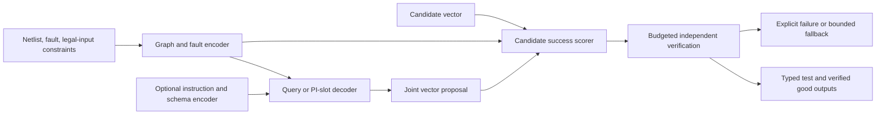

# TypeSafe-inspired ATPG: research and implementation design

Prepared 16 September 2026. Scope: combinational single stuck-at ATPG first,
with a general-purpose decision-model extension. This is a research assessment
and proposed implementation, not a reproduction of Jev or a trained-model result.

Repository inspected: `libatpgllm`, HEAD
`f34692a4afee93705abfc0cd44101d7a397fa6fb`, including existing local evaluator
changes. Those changes were not modified. Companion document:
[experiment analysis and preregistration](TYPESAFE_ATPG_EXPERIMENT_ANALYSIS.md).

## Executive summary

**Build a fault-conditioned graph model with typed decision heads first, then
test a masked-diffusion vector generator against strong autoregressive and
model-free baselines.** This separates the easiest TypeSafe-like capability to
build—fast probabilistic decisions—from the harder ATPG requirement of generating
a jointly valid vector.

My leading architectural hypothesis for Jev is an encoder or shared-context
network with parallel question/criterion scoring and a deterministic typed
output layer. Masked diffusion is plausible, particularly after distillation,
but the public evidence does not establish that Jev uses it. Nor does it establish
that TypeSafe replaced Transformer attention. These are qualitative hypotheses,
not estimated probabilities of private designs.

The useful research target is a measurable capability: better independently
verified fault coverage per unit of total compute, with informative probabilities
and guaranteed output structure. Claiming a private-architecture replication or
frontier general intelligence would require evidence we do not have.

## 1. Public evidence and what it establishes

Sources below were accessed on 16 September 2026. They are primary company
documentation, author papers, or official implementations. Company performance
claims have not been independently reproduced here.

| Observation | Status and implication | Primary source |
| --- | --- | --- |
| Jev has a new architecture, parallel sampler, and a training method called Reinforcement Learning for Calibrated Decisions (RLCD); it gives up free-form string generation | Company disclosure of product properties; no detailed architecture or RLCD equations found in the reviewed material | [Launch post](https://typesafe.ai/blog/introducing-system-one-models-and-jev) |
| State plus typed questions produces Choice, Score, and Noul answers; questions are evaluated independently | Supports parallel conditional prediction; a single API request does not establish a single neural-network pass | [Introduction](https://docs.typesafe.ai/introduction) |
| Choice returns a normalized distribution and its maximum-probability option; options have descriptions; the documented limit is 255 | Compatible with dynamic candidate scoring, rather than an unrestricted vocabulary decoder | [Choice](https://docs.typesafe.ai/primitives/choice) |
| Score uses 2–10 described levels; each is evaluated separately, without seeing neighbouring levels or its numeric index; the returned score is a probability-weighted mean | Especially suggestive of criterion scoring plus output aggregation; the aggregation's neural implementation remains unknown | [Score](https://docs.typesafe.ai/primitives/score) |
| Noul returns a yes-probability, without a separate confidence field | Binary probabilistic judgment is a native primitive | [Noul](https://docs.typesafe.ai/primitives/noul) |
| Choice/Score confidence is derived from the returned probability distribution | Do not infer a separate epistemic-uncertainty head or ensemble from this field | [Confidence](https://docs.typesafe.ai/confidence) |
| TypeSafe describes RLCD as a post-training alternative to RLHF/RLVR | Consistent with adaptation of pretrained representations; does not reveal initialization, data, losses, or optimization | [AI primer](https://docs.typesafe.ai/introduction/machine-learning-primer) |

The launch's 193.6× speed and 444.6× price comparisons concern company-designed
workflows, using other models' probabilities as references. The post notes
favourable conditions and says these gains may be near the high end. They do not
establish equal-quality ATPG speedups, equal-hardware FLOP savings, or objective
ground-truth calibration. Its zero-error argument concerns schema validity.
[Launch methodology](https://typesafe.ai/blog/introducing-system-one-models-and-jev).

The public [LLM adapter](https://github.com/typesafe-ai/system-one-adapter-python)
offers probability and discrete-answer modes, structured output, normalization,
and retries. These choices affect a latency comparison; it is an API baseline,
not Jev's weights or architecture.

I did not locate the exact RNN-to-LLM analogy in the reviewed launch, documentation,
manifesto, or targeted searches. Treat that wording as the user's reported claim.
Technically, model scale, network backbone, output factorization, and training
objective are separate axes. RNNs can be language models, and diffusion language
models can use Transformers.

## 2. Plausible architectures, ranked by compatibility

The following are my inferences and proposed mechanisms, not TypeSafe disclosures.

| Rank | Candidate | Why it fits | Missing evidence / distinguishing test |
| --- | --- | --- | --- |
| 1 | Shared state encoder with parallel question/criterion scorers and typed aggregation | Naturally handles described choices, isolated questions, probabilities, and little incremental decoding latency | Cannot tell whether state features are reused, independently batched, or recomputed. Sweep state length, question count, and option count |
| 2 | Transformer adapted from an LLM, using bidirectional or block-isolated query tokens and classification heads | Reuses semantic pretraining; removes autoregressive output serialization | Attention masks and initialization undisclosed. Compare question-order and unrelated-question perturbations |
| 3 | Few-step masked diffusion or distilled non-autoregressive decoder over typed slots | Can generate many values together and refine coupled outputs | No public evidence of corruption, denoising steps, or a diffusion objective. Ordinary iterative diffusion is unnecessary for isolated categorical judgments |
| 4 | Latent-variable or energy-based predictor with parallel candidate evaluation | Could model ambiguity or correlated decisions with compact latent computation | Sampling/training could be more expensive; no public disclosure supporting these mechanisms |
| 5 | Conventional autoregressive engine with restricted decoding and heavy batching | Useful baseline; could explain some interface-level behaviour | Less consistent with the stated removal of text generation, though the API alone cannot exclude hidden internal decoding |

MoE, state-space layers, linear attention, quantization, speculative methods, and
custom kernels are orthogonal implementation possibilities. Public latency and
pricing do not identify any of them. A calibrated distribution also does not
identify an architecture: several model families can be trained and calibrated.

For an open implementation of hypothesis 1, encode circuit/state once, encode
each question and option, apply cross-attention from those queries into state
memory, then produce small numeric heads. Keep separate questions isolated if
independent-question semantics are required. A softmax is a reasonable *our-model*
choice for mutually exclusive options; it is not a discovered Jev detail.

## 3. Where LLaDA fits

LLaDA uses a Transformer mask predictor and a masked-diffusion generative
objective. It changes the output distribution and sampling process rather than
discarding Transformers. The original 8B model was trained from scratch, so its
results do not imply that changing an existing fine-tuning flag recreates it.
[LLaDA paper](https://arxiv.org/abs/2502.09992).

The official implementation explicitly warns that the original sampler can be
slower than its autoregressive baseline: repeated sequence computation and
quality versus step-count tradeoffs matter. That warning concerns that model and
sampler, not every subsequent diffusion system. The repository now also lists
iLLaDA; checkpoint-specific configuration must be pinned.
[Official repository](https://github.com/ML-GSAI/LLaDA).

The June 2026 iLLaDA paper reports an 8B model with 12T pretraining tokens and
substantial instruction training. That is a useful scale reference, not the
starting budget for a domain-specific ATPG model.
[iLLaDA](https://arxiv.org/abs/2606.25331).

Three feasible initialization routes should remain distinct:

1. **Recommended first:** reuse this repository's graph encoder and train a small
   typed scorer/denoiser. This tests the ATPG hypothesis economically, but does
   not inherit broad language knowledge automatically.
2. **Language-capable comparator:** adapt an existing diffusion checkpoint using
   its native masks, tokenizer, output alignment, and sampler. Add graph context
   only after reproducing a small inference/training smoke test.
3. **Higher-risk research branch:** convert a causal model with continued
   pretraining. DiffuLLaMA demonstrates such adaptation; Dream illustrates that
   initialization helps but still requires extensive training. Dream also uses
   shifted prediction, so a universal “diffusion always has no shift” rule is
   wrong. Our new typed-slot denoiser will explicitly use same-position targets.
   [DiffuLLaMA](https://arxiv.org/abs/2410.17891),
   [Dream authors' training account](https://hkunlp.github.io/blog/2025/dream/).

## 4. ATPG changes the statistical problem

For a circuit C, target fault f, and legal primary-input vector x, define
`D(C,f,x) = 1[g_C(x) != g_C,f(x)]` over the declared observable outputs.
The task has many correct vectors. Do not train or evaluate as though matching
one ATPG teacher vector were the only success.

Independent bit probabilities are insufficient to represent arbitrary valid
vector distributions. Consider a toy target detected by exactly `01` or `10`.
Both bit marginals can equal 0.5; independent sampling then emits the two invalid
vectors half the time. For m independent pairs requiring opposite bits, valid
sampling probability becomes `2^-m`. This is an illustrative construction, not
a measured benchmark result. Correlated sampling, conditional refinement, or
search must solve this dependence problem.

Separate three probabilities in the interface:

* `proposal_bit_probability`: probability under a learned vector proposal;
  it does not measure whether a bit is universally “correct.”
* `candidate_detection_probability`: predicted success of a specified full
  candidate, calibrated on candidates from the deployed proposal policy.
* `run_success_probability`: optional probability that a specified bounded
  search succeeds; this requires labels for complete searches, including failures.

Neither a product of bit marginals nor mean denoising confidence is an established
estimate of vector detection probability. Simulator verification remains the
authority for individual deployed tests.

## 5. Recommended architecture



### 5.1 Track A: parallel decision model

Begin with `q_phi(D=1 | C,f,x)` for complete candidate vectors and, optionally,
auxiliary activation/propagation judgments. Attach PI values through explicit
port-to-graph incidence; do not flatten arbitrary port ordering without its map.
Score a batch of candidates in parallel. Candidates may initially come from
uniform random, weighted random, existing LLMs, or classical ATPG.

Train a shared scorer with binary cross-entropy on each candidate's true
detection outcome. Several candidates may detect the same fault, so a softmax
over candidates is not a distribution of individual detection probabilities.
If implementing a separate “choose the best candidate” policy, give it a separate
categorical head and define its utility and tie policy.

Start with the existing graph stack and 4–8 decoder/scoring blocks, width 256–512,
as proposed sweep ranges. Count actual trainable parameters. Keep a graph-only
control, a text-only encoder control, and a graph-plus-text version; do not assume
language or graph fusion helps. Graph representation research supplies precedent
for learning circuit functionality, not proof of this proposed ATPG result.
[DeepGate2](https://arxiv.org/abs/2305.16373).

### 5.2 Track B: typed masked-diffusion proposal

Represent each PI as a slot with input alphabet `{0,1,MASK}` and output alphabet
`{0,1}`. PAD is a distinct batching concept, never a legal value. The circuit
determines vector length, so this primary design needs no EOS prediction.
Clamp prescribed input constraints and exclude them from corruption. Store their
values in the conditioning state.

Use bidirectional self-attention among PI slots and cross-attention to graph
memory, with explicit PI identity/incidence and target-fault conditioning.
Unmasked slots supply partial assignments. Begin generation with all free slots
masked, then predict and commit subsets over a fixed number of rounds. Compare
random unmasking with confidence-based schedules; treat the latter as a sampling
heuristic whose actual distribution and quality must be measured.

A first engineering grid is 4, 8, 16, and 32 rounds, plus one-shot and one-slot-
at-a-time endpoints on manageable vectors. Ensure each schedule completes all
free slots; no-op rounds and all-clamped examples must have explicit handling.
The original LLaDA/MDLM motivation supports denoising objectives. MaskGIT provides
an iterative parallel-refinement precedent in images; its speedups cannot be
transferred to ATPG.
[MDLM](https://arxiv.org/abs/2406.07524),
[MaskGIT](https://arxiv.org/abs/2202.04200).

### 5.3 Graph and caching details that matter here

The current parser has gate-instance nodes, not a ready-made PI-slot encoder.
Add an explicit mapping from every canonical PI to its fanout gate/pin incidences,
including unused PIs, buses, constants, escaped identifiers, and direct PI-to-PO
connections. Preserve pin roles for asymmetric gates. An unordered gate adjacency
alone can discard functional distinctions; audit this before relying on it.

The existing graph encoder consumes fault features. Its output therefore cannot
be cached across different faults using only a circuit hash. Initially key cache
entries by circuit, fault, constraints, gate-library version, graph vocabulary,
checkpoint, and precision. A later optimization can separate a circuit-only trunk
from a fault-conditioned decoder, but it changes the model and needs an ablation.

Caching graph memory across denoising rounds is exact only when that memory is
computed independently of the changing vector. A scorer that injects candidate
bits into the graph must recompute its candidate-dependent branch. A fully
bidirectional text diffusion model generally changes hidden context states as
the answer changes; ordinary causal KV caching cannot just be reused unchanged.

## 6. Dataset and labels

Build a versioned record format from authoritative structured source fields,
not by extracting truth from the model's generated rationale:

```text
problem: circuit_hash, family_id, netlist, library_hash, fault_spec,
         canonical_pi_order, canonical_po_order, legal_input_constraints
targets: verified_vectors[], verified_good_outputs[], witness_source,
         testability_status, proof_or_witness_reference
candidate: vector, detected, sound_if_outputs_proposed, simulator_identity,
           proposal_origin, selection_policy, status
provenance: split_id, source_revision, transformations, parent_design_id
```

Keep these datasets separate: positive complete vectors for proposal training;
positive/negative candidates for success prediction; optional partial-assignment
solver examples; auxiliary node labels; and held-out calibration data. A failed
candidate is a negative for that candidate, not proof that the fault is untestable.
An ATPG/SAT timeout remains unresolved. Proof-backed untestability is a separate
status and may support a routing head only after its contract is defined.

Split by source design family before enumerating faults, vectors, augmentations,
or teachers. Allocate distinct train, model-selection validation, calibration,
and final test families. When families are scarce, use grouped cross-fitting for
development, retaining an untouched final test. Do not infer family separation
from a raw-netlist hash alone.

Balance circuit/fault sampling; otherwise an easy design with thousands of
patterns dominates. Retain several diverse independently checked solutions per
fault where available. Diversify teachers using different solver seeds, blocking
clauses, random simulation, and existing proposal models. Repeated corruptions
increase optimization examples, not the number of independent designs.

Do not interpret every unspecified teacher input as a universally safe don't-care.
For cubes, first declare existential versus all-fill semantics; for the initial
version use verified binary completions. State the solution-sampling distribution:
learning a solver's biased samples is not uniform sampling of all valid tests.

The graph code attaches snapshot/propagation/backtrack information as labels while
the inference encoder reads structural and fault features. Preserve that boundary.
The Stage-1 text-caption path can include rendered reasoning or answers; use that
only as a training target/teacher view. Do not feed such captions as unknown-test
inference state.

## 7. Objectives and training sequence

### 7.1 Proposal denoising

Our proposed objective adapts masked denoising to free PI slots. For example b,
let m_b be its number of free slots. Draw `t ~ Uniform(epsilon,1)` and independently
mask each free slot with probability t. With M the resulting mask:

```text
L_denoise = mean_b [ (1/m_b) sum_i M_bi/t_b *
                    CE(logits_bi, clean_bit_bi) ]
```

Use same-position targets in this new decoder. Context and prescribed bits remain
visible. The inverse corruption weighting and conditional reconstruction are
motivated by [LLaDA's training guidelines](https://github.com/ML-GSAI/LLaDA/blob/main/GUIDELINES.md).
Our truncation at epsilon is a practical finite objective; do not claim an exact
full-interval likelihood bound without the required derivation/end correction.

For this estimator, zero-masked draws contribute zero; use a differentiable zero
when an entire batch has no selected sites. Forcing at least one mask changes the
sampling distribution and requires a corrected estimator or an explicitly new
objective. Handle m_b=0 outside the denoising loss. Reduce sums/counts correctly
across distributed workers so padding and varying lengths do not change weights.

Specify separately whether to add an all-masked training component to improve the
initial generation state. If used, report it as a mixture objective and ablate its
weight; do not silently call it the identical LLaDA objective.

### 7.2 Calibrated candidate decisions

Use `L_success = BCEWithLogits(s_phi(C,f,x), D(C,f,x))` and report both negative
log-likelihood and Brier score. Proper scoring rules encourage truthful probability
estimates in expectation; they do not guarantee finite-sample calibration or
out-of-distribution reliability.
[Gneiting and Raftery](https://doi.org/10.1198/016214506000001437).

Use a separate calibration split and temperature or logistic calibration selected
without the final test. Temperature scaling has strong empirical precedent but
must be checked here. Report reliability and discrimination together; a constant
base-rate predictor can be calibrated while useless for ranking.
[Guo et al.](https://proceedings.mlr.press/v70/guo17a.html).

Negatives should match candidate sources used at inference. If training rebalances
rare successes, record sampling probabilities and correct weighting/prior shift,
or recalibrate on the deployment mixture. Evaluate calibration after candidate
selection as well as before it. Changing the proposer, search budget, precision,
or sampler can invalidate the fitted calibration.

Start with a separately trained scorer to isolate effects. Joint representation
training with `L_denoise + lambda_s L_success + lambda_a L_aux` is an ablation,
with validation-selected weights and distinct label masks. No component is an
implementation of undisclosed RLCD merely because it predicts probabilities.

### 7.3 Verifier-based improvement

First perform conservative supervised improvement: generate training-circuit
candidates, verify them, retain diverse successful vectors, and retrain with a
fixed fraction of original demonstrations. Preserve failures for the scorer.
This is iterative dataset improvement, not an unbiased policy-gradient algorithm.

Only then add RL if it improves equal-cost performance. For a stochastic denoising
policy, probability belongs to a sequence of unmasking/actions. Record which slots
were committed, sampled values, schedule, logits, old-policy version, and any
reference probabilities. Fixed, policy-independent schedules simplify trajectory
likelihoods. Confidence-driven stochastic schedules require their selection
probabilities in a valid trajectory treatment; a heuristic surrogate must be
identified as such.

An alternative is a published diffusion-specific likelihood surrogate. Coupled-GRPO
and VRPO address estimation issues absent from ordinary causal-token likelihoods;
port one only with its assumptions, estimator, and validation intact.
[DiffuCoder](https://arxiv.org/abs/2506.20639),
[LLaDA 1.5](https://arxiv.org/abs/2505.19223).

Do not put negative denoising loss into the existing causal GRPO likelihood ratio
and label it exact. Keep the success estimator trained with a proper scoring loss;
rewarding it simply for reporting higher success would destroy its meaning.

### 7.4 Distillation and serving

After a competent joint generator exists, distill to fewer rounds or a latent
proposal decoder. Validate diversity and hard-fault coverage, not just bitwise
teacher agreement. Distilling only marginals can recreate the dependence failure.
Apply quantization and kernel optimizations after BF16 correctness; recalibrate
and retest the final deployed precision. Serialization is deterministic code.

## 8. Concrete repository changes

Paths in the following table are relative to `libatpgllm`. New paths are proposals;
this report does not add model implementations.

| Area and current anchor | Required change | Reuse / acceptance condition |
| --- | --- | --- |
| `scripts/train/training_code.py:243`, `:527` | Keep causal SFT/GRPO as baseline; add `scripts/train/train_decision_model.py` and `train_masked_atpg.py` entry points | No accidental causal label shift or text completion assumptions in new trainers |
| `atpgllm/training/model_utils.py:148` | Add separate model builders under `atpgllm/decision/loading.py`; choose encoder/typed/diffusion loading explicitly | Current loader returns `AutoModelForCausalLM`; changing only model name is insufficient |
| `atpgllm/training/dataset_utils.py:750` | Add `atpgllm/decision/data.py` with typed records, ragged PI masks, corruption and collators | Reuse source rendering only for optional input instructions; prevent answer leakage |
| `atpgllm/training/sft_validation.py:12` | Reuse provenance audit; extend manifest to distinct family-level calibration split and richer fault population | Resume must reject changed data/split/sampler identities |
| `atpgllm/graph/models_stage1.py:256` and `:176` | Reuse graph/Q-Former components via `atpgllm/decision/model.py`; add PI incidence queries and head types | Graph-only, text-only, and fused ablations; test fault dependence |
| `atpgllm/graph/netlist_parser.py`, `fault_context.py:115` | Preserve canonical PI/PO order, pin roles and fault identity in explicit metadata | Round-trip renamed/reordered circuits; labels absent from inference features |
| `atpgllm/graph/stage2_model.py:64`, `atpgllm/multimodal/model.py:13` | Add typed decoder alongside graph-to-causal-LM path | Existing `generate()` and soft prompts remain AR baselines |
| New `atpgllm/decision/losses.py`, `sampling.py`, `calibration.py` | Implement weighted corruption loss, fixed-step sampler, candidate probability calibration | Tiny exact distribution checks, padding/constraint checks and saved calibration provenance |
| `atpgllm/training/search_verifier.py:77` | Add a typed-vector verification entry point using the same authoritative problem contract | Independently audit backend; avoid parsing generated text to recover numeric outputs |
| `atpgllm/training/search_types.py` | Extend versioned usage records with rounds, neural evaluations, GPU time and candidate count | Zero output text tokens must not mean zero inference work |
| `atpgllm/training/search_backends.py` | Add explicit typed prediction backend; do not route through causal `HFGenerator`/`VLLMGenerator` | Preserve seeds, per-slot failures, budgets and provenance |
| `scripts/eval/evaluate_model.py` | Add a companion `scripts/eval/evaluate_decision_model.py` using a common saved-result schema | Paired D/U, coverage, calibration and cost; protect current local evaluator changes |
| `atpgllm/training/checkpoints.py` and new model config | Save architecture, graph vocabulary, PI schema, corruption schedule, calibration, RNG and optimizer state | Resume and export equivalence checks |
| `requirements.txt`, `pyproject.toml` | Create an isolated, tested dependency lock for the new track | Existing pins include Torch 2.5.1, Transformers 4.48.2, TRL 0.7.11; do not assume compatibility with all present training APIs |

Use native PyTorch/PyG for the small graph track. For a pretrained diffusion track,
pin the checkpoint revision and matching reference implementation in a separate
environment. Prove attention semantics in eager mode, then check the chosen
optimized backend against it. A noncausal configuration flag alone is not evidence
that every kernel path obeys it. Fine-tuning newly initialized heads/embeddings
also requires explicitly including them in optimizer and checkpoint state; LoRA
targeting alone may omit them.

## 9. Execution roadmap and resource controls

These are proposed engineering milestones, not completion dates or measured costs.
Pilot data scale and runtime must be measured before reserving a large campaign.

Use the following explicit starter configuration for the small graph track.
These are initial experiment settings, not tuned recommendations or Jev details:

| Setting | Initial choice and bounded development sweep |
| --- | --- |
| Optimizer | AdamW; new heads/decoder LR `1e-4`, compare `3e-5` and `3e-4`; reused encoder initially frozen, then optional `1e-5` unfreezing |
| Schedule | 5% warmup, cosine decay, gradient-norm clip 1.0; stop on a fixed update/processed-slot budget and validation performance |
| Batch | Target 64 circuit-fault examples per effective batch through accumulation; bucket by graph and PI size and record actual processed slots |
| Corruption | Uniform t on `[0.001,1]`, independent masks on free slots; baseline has no forced masking and no added all-mask mixture |
| Precision | BF16 where supported after a small FP32 reference check; probabilities/loss reductions in FP32 where needed |
| Checkpointing | Save optimizer, scheduler, RNG and data cursor; evaluate initially and every 500 updates, more frequently for short pilots |
| Selection | Fixed-budget validation D/coverage and serving cost determine proposal selection; scorer NLL/Brier plus ranking utility determine scorer selection |
| Calibration | Fit only after model/selector selection, on separate calibration families; freeze before final test |

Monitor loss by corruption ratio, free-slot count and circuit size; rare low-t
terms can create large gradients. If changing the mask distribution to reduce
variance, derive the corresponding weights and record the new objective. For
pretrained text diffusion, start from its documented training convention rather
than copying these graph-track hyperparameters. Do not silently truncate a netlist
or omit PIs to meet a sequence limit: bucket, partition with preserved semantics,
or record an explicit unsupported-size outcome.

| Phase | Deliverable | Dependency and exit gate |
| --- | --- | --- |
| P0: contracts and baseline | Fixed semantics, family splits, independent tiny-circuit oracle, baseline outputs and cost traces | Must pass evaluator and leakage audit before model comparison |
| P1: decision scorer | Graph-conditioned candidate success model, calibrated on unseen development families | Must beat base-rate and simple feature controls and show useful equal-budget ranking |
| P2: joint proposal | Small typed denoiser, independent-bit and AR-vector controls | Must solve dependence toy tests and show a useful real-circuit quality/cost frontier |
| P3: training improvement | Verified-data iteration; optional diffusion-native RL | Incremental gain survives equal verifier-budget comparison and calibration audit |
| P4: serving/distillation | Reduced-step model, typed serializer, final precision | Quality gate survives on locked test and OOD splits; all costs included |
| P5: broader interface | Text-conditioned described options and scores across multiple domains | New task-family and schema-generalization evaluation; no inference of generality from ATPG alone |

Start P1/P2 with roughly 10–100M parameters if the graph representation suffices;
advance to 100–300M only when learning curves support it. An optional 1–3B language
backbone is a separate branch. An 8B diffusion model is a research comparator or
teacher, not the default prototype. These size bands are planning choices.

Use a first data pilot of up to 100,000 verified candidate records and 1–4 diverse
positive vectors per available training fault, capped by independent family
availability and simulator budget. Audit the available corpus first; these are
target caps, not assertions about dataset size. Scale using family count,
difficulty coverage, and validation learning curves—not repeated rows alone.

For dense Transformer planning, `training_FLOPs ≈ 6*N*D` is a rough parameter-matmul
estimate, where D counts processed token/slot positions across all passes. It
omits attention overhead, graph work, recomputation, RL rollouts and simulation.
Measure realized tokens/slots per second and use `GPU_hours = GPUs * elapsed_hours`
for actual budgeting. No throughput assumption should be mistaken for a quote.

As an illustrative memory calculation, a conventional mixed-precision Adam
configuration can require about 16 bytes/parameter for weights, gradients, master
weights and moments: 100M → 1.6 GB, 300M → 4.8 GB, 1B → 16 GB, 8B → 128 GB,
before activations and graph batches. Actual layouts, sharding, frozen weights,
and adapters change this. A 4-bit base-model fit is not evidence that full training
fits. This session could not query a working NVIDIA driver; no GPU capacity or
training duration has been established.

Profile prefill/encoding, each refinement round, scoring, serialization,
verification and fallback separately. Approximate latency as:

```text
AR:        T_encode + output_tokens*T_incremental_decode + T_verify
typed:     T_graph + T_questions_and_heads + T_verify
diffusion: T_graph + rounds*T_slot_decoder + T_score + T_verify
```

These terms depend on batching, lengths and hardware. The diffusion expression
assumes fixed graph memory; full text diffusion may repeatedly process context.
Measure cold and warm caches, p50/p95 request latency, throughput at fixed batch
sizes, peak memory, and CPU/license queues. Use successful verified tests per
second and coverage per budget, not a cross-architecture output-token rate.

## 10. General-purpose extension

After ATPG, keep the typed output contract but replace hardcoded fault questions
with an instruction/schema encoder. Encode option descriptions dynamically;
a fixed classifier trained on known labels cannot handle arbitrary new schemas.
Separate categorical choice, binary truth, and ordered-score semantics. Keep
questions isolated if promising independence; joint structured tasks require a
separate coupled decoder rather than incompatible interface promises.

Train on diverse, permissioned task families with independently adjudicated
labels, ambiguity distributions where meaningful, and held-out schemas/domains.
Teacher probabilities can help distillation, but are not ground truth for
calibration. Evaluate label permutations, added distractors, paraphrases,
underspecified questions, novel options, and out-of-domain inputs. Fit domain-aware
calibration or abstention policies on development data and disclose failures.

This extension could produce a TypeSafe-inspired open decision model. Broad Jev-like
performance would require a separate data, pretraining and evaluation programme;
an ATPG success is not evidence that this generalization has occurred.

## Appendix: evidence boundaries and artifact status

This investigation inspected public materials and local source code. It did not
query the paid/early-access Jev API, contact TypeSafe, train a model, measure ATPG
performance, or establish a dataset-wide overlap rate. No weights, parameter count,
backbone specification, RLCD loss, or training-data recipe for Jev were identified
in the reviewed sources. API behaviour can constrain hypotheses but cannot uniquely
recover a private architecture.

This Markdown report follows the requested content categories, but is not a rendered
Design Report template artifact. The selected
[Design Report skill](/home/eng/c/cxv200006/.codex/plugins/cache/openai-curated-remote/openai-templates/0.1.1/skills/artifact-template-design-report/SKILL.md)
and [Experiment Analysis skill](/home/eng/c/cxv200006/.codex/plugins/cache/openai-curated-remote/openai-templates/0.1.1/skills/artifact-template-experiment-analysis/SKILL.md)
require: “If no such capability can be identified and read, say it is unavailable
and stop; do not recreate or install it.” Their metadata references retained DOCX
templates, but no compatible advertised document capability/connected session was
available. Template production was stopped; the reference files were unchanged.
