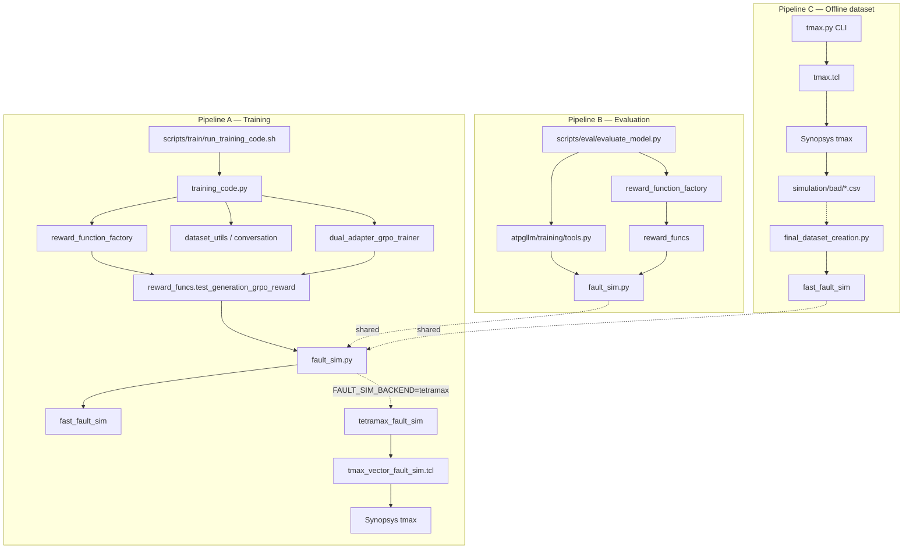

# Fault simulation call tree

How fault simulation is reached from training, eval, and offline dataset build — down to TetraMAX / Python simulators.

**Current layout (post-restructure):** helpers live under `libatpgllm/atpgllm/training/`; CLIs under `libatpgllm/scripts/{train,eval,dataset}/`.  
`libatpgllm/tests/run_training_code.sh` is a **shim** → `scripts/train/run_training_code.sh`.

**Related:** `data_preprocessing/fault_sim.py`, `tetramax_seats.py`, `tetramax_stil.py`, `tmax.py`; `atpgllm/training/reward_function_factory.py`, `atpgllm/llm/reward_funcs.py`.

---

## Layer legend

| Level | Role |
|-------|------|
| **L0** | Shell / CLI |
| **L1** | Training / eval / dataset orchestration |
| **L2** | Trainer loop or eval generation |
| **L3** | Reward / tool wiring |
| **L4** | Scoring + sim API |
| **L5** | TetraMAX orchestration (Python) |
| **L6** | Subprocess / Tcl / vendor binary |

---

## 1. GRPO training — reward path

`RewardFunctionFactory` attached every opt step. If `FAULT_SIM_BACKEND=tetramax|hybrid`, TetraMAX may run per scored completion (seat-limited via `tetramax_seats.py`).

Launcher **cwd** = `libatpgllm/` (`cd` to repo root). Configs: `scripts/train/configs/*.conf`. Artifacts: `OUTPUT_DIR` (e.g. `runs/grpo_…`). `sim_config` → package data `atpgllm/training/data/sim_config.json` (or `SIM_CONFIG`).

```
L0  scripts/train/run_training_code.sh
 └── L1  scripts/train/training_code.py  (run_grpo_training)
      ├── L2  atpgllm/training/dataset_utils.py
      │        format_dataset_for_training()
      │        └── atpgllm/training/conversation.py  (ConversationExample.from_record)
      │
      ├── L2  atpgllm/training/reward_function_factory.py
      │        RewardFunctionFactory.create_reward_function(return_component_dicts=True)
      │
      └── L2  atpgllm/training/dual_adapter_grpo_trainer.py
           │   [or tool_calling_grpo_trainer.py]
           └── DualAdapterGRPOTrainer / ToolCallingGRPOTrainer
                └── reward path → train_scalar_from_reward_components (excludes *_logonly)
                     └── L3  reward_fn(prompts, completions, **dataset columns)
                          └── L4  atpgllm/llm/reward_funcs.py
                               test_generation_grpo_reward()  [per completion]
                               ├── extractors from factory
                               └── fault_sim_runner(...)  ← kwargs["fault_sim"]
                                    └── L5  data_preprocessing/fault_sim.py
                                         resolve_fault_sim_runner()
                                         ├── [fast] fast_fault_sim() → OptimizedNetlist
                                         └── [tetramax|hybrid] tetramax_fault_sim()
                                              ├── tetramax_seats / tetramax_stil / tmax.py APIs
                                              ├── fast_fault_sim() (snapshot DF)
                                              └── L6  tmax -shell -tcl …/tmax_vector_fault_sim.tcl
```

**Parallelism:** trainer duplicates prompts × `num_generations`; reward still sequential per completion. DDP: each rank scores its shard; seats via `TMAX_MAX_CONCURRENT` (default 1).

---

## 2. GRPO training — generation / tool path

```
L0  scripts/train/run_training_code.sh
 └── L1  training_code.py
      └── L2  dual_adapter_grpo_trainer.py  [or tool_calling_grpo_trainer.py]
           _generate_tool_continuation() / generation
           └── tool_functions["fault_simulation_tool"]
                └── L3  atpgllm/training/tools.py
                     fault_simulation_tool_handler()
                     ├── OptimizedNetlist (factory + sim_config)
                     └── resolve_fault_sim_runner() → same L5/L6 as §1
```

---

## 3. Evaluation

```
L0  scripts/eval/evaluate_model.py
 ├── L2  generate_with_tools() / diversity sampling
 │    └── execute_tool_call()
 │         └── L3  atpgllm/training/tools.py → L5/L6
 │
 └── L2  reward metrics
      ├── L3  atpgllm/training/reward_function_factory.py
      └── L4  reward_funcs.test_generation_reward / grpo_reward → L5/L6
```

Shell wrappers: `scripts/eval/eval_{grpo,sft}_{7b,32b}_policy_checkpoints.sh`.

---

## 4. Offline dataset construction (batch TetraMAX)

Gold `detected_faults` for HF dataset come from this path — **not** from the train launcher.

```
L0  [EDA job]  python data_preprocessing/tmax.py
 └── L6  tmax -shell -tcl data_preprocessing/scripts/tmax.tcl
      └── …/<module>/simulation/bad/machine_detected_faults_<N>.csv

L0  data_preprocessing/final_dataset_creation.py
 └── reads tetramax_folder CSVs
 └── L4  fault_sim.fast_fault_sim() + data_preprocessing/sim_config.json
```

---

## 5. Legacy reward path (inactive for factory)

```
L4  atpgllm/llm/reward_funcs.py
 └── [only if lib_gate_funcs is None]
      atpgllm/llm/fault_coverage_calc.py  fault_sim()
```

Factory always supplies `lib_gate_funcs` → production uses `data_preprocessing/fault_sim.py`.

---

## 6. Standalone utility

```
L0  data_preprocessing/run_fault_simulations.py
 └── data_preprocessing/fault_simulator.py  run_simulation()
```

---

## Layer cake (three independent pipelines)

```
PIPELINE A — training (libatpgllm/)
  scripts/train/run_training_code.sh → training_code.py
    → dual_adapter_grpo_trainer / tool_calling_grpo_trainer
    → dataset_utils → conversation
    → reward_function_factory → reward_funcs
    → fault_sim.py (optional tetramax via FAULT_SIM_BACKEND)

PIPELINE B — eval
  scripts/eval/evaluate_model.py
    → tools, reward_function_factory, reward_funcs → fault_sim.py

PIPELINE C — offline HF dataset
  [optional] tmax.py → tmax.tcl → CSVs on disk
  final_dataset_creation.py → fast_fault_sim only
```

---

## Files by depth

| Depth | Paths |
|-------|--------|
| **L0** | `scripts/train/run_training_code.sh`, `training_code.py`, `scripts/eval/evaluate_model.py`, `final_dataset_creation.py`, `tmax.py` |
| **L1–L2** | `atpgllm/training/{dual_adapter_grpo_trainer,tool_calling_grpo_trainer,dataset_utils,conversation}.py` |
| **L3** | `atpgllm/training/{reward_function_factory,tools}.py` |
| **L4** | `atpgllm/llm/reward_funcs.py`, `data_preprocessing/fault_sim.py` |
| **L5** | `tetramax_fault_sim`, `tetramax_seats.py`, `tetramax_stil.py`, `tmax.py` |
| **L6** | `scripts/tmax_vector_fault_sim.tcl`, `scripts/tmax.tcl`, Synopsys `tmax` |

---

## TetraMAX env controls (`data_preprocessing/tetramax_seats.py`)

| Variable | Default | Effect |
|----------|---------|--------|
| `FAULT_SIM_BACKEND` | `fast` | `fast` / `tetramax` / `hybrid` |
| `TMAX_MAX_CONCURRENT` | `1` | Max simultaneous `tmax` per Unix user/host |
| `TMAX_TIMEOUT_S` | `600` | Kill `tmax` after wall time |
| `TMAX_ACQUIRE_TIMEOUT_S` | `1800` | Max wait for seat |
| `TMAX_LOCK_DIR` | `/tmp/tmax_seats_<uid>` | Seat locks |
| `TMAX_RESULT_CACHE_SIZE` | `0` | In-process LRU (per rank) |

Prefer `FAULT_SIM_BACKEND=fast` for long GRPO; `tetramax`/`hybrid` for eval/spot checks.

---

## Mermaid overview



---

*Update when entry points or sim backends change.*
