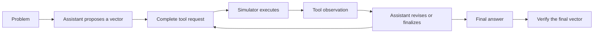

# Proposed design: search inside a conversation

This document records the design proposal. The initial implementation is now
available; see [implementation status and run instructions](IMPLEMENTATION.md)
for exact behavior and remaining experiments. Read the
[review](IMPLEMENTATION_REVIEW.md) for the historical behavior that motivated it.

Use one shared conversation runner for all model-based sampling methods. MCTS
chooses which conversation state to extend. Evolution chooses which candidate
to revise. The runner handles generation, tool execution, budgets, and scoring.

## 1. What counts as one completion

A completion is one selected path from the original problem to the final
assistant answer. It includes the tool exchanges that actually happened on that
path. Other branches stay in a separate search trace.



For example, suppose `y = a AND b`, and the target is `y` stuck at zero. The
candidate `a=1, b=0` produces zero in both machines. The candidate `a=1, b=1`
produces one in the good machine and zero in the faulty machine, detecting the
fault.

MCTS can save the first failed tool result and try different next assistant
steps from there. Evolution can propose changing `b`, construct a new request,
and simulate that request. In both cases the final answer should contain:

```text
INPUT_VECTOR: "a: 1, b: 1"
EXPECTED_OUTPUT: "y: 1"
DETECTED_FAULTS: "sa0 y"
```

The final answer's vector is the one that must be verified. An old failed vector
in the conversation must not become the scored answer merely because it appears
first in the text.

## 2. Store state explicitly

Keep messages and execution records as the source of truth. Render strings only
at model and logging boundaries.

| Object | Minimum information |
| --- | --- |
| `ProblemContext` | Authoritative record ID, netlist content hash, module, target fault, ordered PIs/POs, simulator configuration. No reference answer or reference solution trace. |
| `ConversationState` | Immutable message history, open assistant token buffer, pending call, completed tool exchanges, path token/tool counts, status. |
| `GenerationResult` | Generated token IDs/text, finish reason, stop reason, sampled-token log-probabilities when available, actual usage, request seed. |
| `ToolObservation` | Call ID, validated arguments, simulator identity, result or typed error, vector/cache key, actual execution provenance. |
| `Candidate` | State, explicit final answer if present, canonical vector, verified score/status, parent IDs and mutation operation. |
| `SearchContext` | One slot's random streams, budget ledger, caches, best candidate, search trace. |

Clone states without mutable lists shared between siblings. Reusing a saved
prefix does not execute its old calls again. Tool observations are immutable;
changing arguments creates a new call and observation.

Use these state statuses: `GENERATING`, `PENDING_TOOL`, `READY`, `FINAL`,
`INVALID`, `EXHAUSTED`, and `INFRA_ERROR`. A generation stopped by a token limit
remains incomplete. EOS after a complete tool request ends that assistant turn,
not the entire completion.

### A safe conversation boundary

The runner offers `advance(state)`, which returns the next complete assistant
action and, when applicable, its resolved tool exchange. A complete action is a
validated tool request, a final answer, or a completed assistant continuation.
Small token chunks may be used internally, but they are not independently
editable actions.

1. Resolve an already complete pending request before asking for more model text.
2. Otherwise continue the open assistant buffer with the real token prefix.
3. Stop at a complete tool request or assistant-turn end. Keep an incomplete
   JSON/XML request buffered; continue within a bounded token allowance.
4. Validate the call, execute it once, and append both assistant and tool messages.
5. Reapply the model's chat template to the entire history before continuing.

If a backend generates text beyond a completed tool request, discard that
speculative suffix and regenerate after the observation. Count discarded tokens
as work. Add backend stopping support where possible to avoid that waste.

Support the existing JSON and Granite XML formats through the shared parser and
template utilities. Store canonical tool-call dictionaries and serialize their
arguments only as required by the tokenizer. A small integration test must
verify the actual rendered prompt for each supported template.

Initially accept one tool request per assistant action. Return a structured
protocol error for multiple calls instead of silently executing just the first.
Unknown tools, malformed arguments, and incomplete calls receive distinct
statuses. Allow one bounded repair opportunity when the remaining budget permits.
At the tool cap, a pending request is an incomplete path, not a successful answer.

### Bind each simulation to the problem

Use the authoritative netlist, module/doc ID, and target fault from
`ProblemContext`. Reject a model request for a different target instead of
silently changing the experiment. Validate input names, widths, duplicate
assignments, and allowed bit values against the netlist.

The existing tool takes `output_vector` as well as `input_vector`. Preserve that
schema initially, validate PO names, and preserve the model's proposed values.
Calculate actual good/faulty outputs independently; proposed PO values cannot
decide which POs count for detection. Missing/unknown values need an explicit
policy; the initial design requires full binary PI assignments.

Tools return simulator data, not reference answers. With tools disabled, search
may score candidates privately, but must not insert verifier observations into
the model conversation as if the model had requested a tool.

## 3. Score the final answer and keep errors separate

Extract `INPUT_VECTOR`, `EXPECTED_OUTPUT`, and `DETECTED_FAULTS` from the explicit
final assistant answer. Require one unambiguous set of fields there. Keep the
whole transcript for inspection and tool-format diagnostics. A structured
answer object should drive simulation; global first-match regexes must not
choose the candidate.

The final vector and the vector from the last tool call may differ. Reuse a
simulation only when the full simulation key matches; otherwise verify again.
Select any observation used for fidelity checks by matching its vector and
provenance, not by its position in the transcript.

Separate three concepts:

- **Verified detection:** the authoritative simulator confirms a good/faulty
  difference at a PO for the final vector.
- **Acceptance:** the final answer meets the configured evaluation criterion.
  `full_accuracy` also requires complete correct inputs, expected outputs, and
  target-fault reporting. A detecting tool observation alone is not a final answer.
- **Search value:** a bounded measure that helps choose another branch before
  an accepted completion exists.

Start with this explicit value for valid, scored candidates:

```text
1.0    accepted under the configured criterion
0.8    verified detection, but final-answer requirements still need repair
0.2    valid simulation with the target fault activated, but no detection
0.0    valid simulation without activation, or an invalid candidate
```

These values are proposed initial settings, not fitted probabilities. They avoid
the current sigmoid/min-max indirection. Infrastructure errors have no search
value: record them and apply a bounded retry policy without treating them as a
negative circuit result. Reserve the remaining cost before retrying.

Final selection ranks acceptance first, then detection, then validity/activation,
answer fidelity, and a stable tie-break. Share the acceptance predicate with the
evaluator. Under `fault_detected`, retain the existing detection metric and also
report final-answer completeness. Under `full_accuracy`, use the remaining
budget to repair a detecting candidate's answer. Keep `positive_reward` only as
a named legacy diagnostic; do not present it as fault-detection success.

When only answer fidelity is wrong, preserve the already detecting input vector
and ask for a corrected final answer from its matching observation. Reuse the
verified simulation for that unchanged vector. This avoids spending search work
finding another detecting vector just to fix the reported expected output.

Activation is already available in the reward components. A later experiment
may measure how far a good/faulty difference reaches through a circuit using
internal simulator traces. Define this per supported circuit/backend, keep it
below detection in value, and compare it against activation alone. Do not assume
that distance or the number of differing internal nets always measures progress.

## 4. MCTS: branch at useful conversation steps

A node stores a `ConversationState`. An edge represents a sampled assistant
action and its actual tool result, when the action calls a tool. After the result,
the next node is ready for an informed continuation.

```text
problem
  -> request vector A -> observation: no activation
       -> revised request C -> observation: activated, not detected
       -> revised request D -> observation: detected -> final answer
  -> request vector B -> observation: activated, not detected
       -> ...
```

The observation is determined by the simulator, so it is not another LM choice
to sample. Initial implementation assumes a deterministic configured simulator.

### One search

```text
create an empty root and one budget ledger
while another attempt is affordable and an open frontier exists:
    select a path, allowing nodes to add actions as their visit counts grow
    sample or reuse an action; resolve any tool call through the runner
    complete a bounded rollout from the resulting state
    verify the explicit final answer, or record an incomplete/invalid attempt
    remember the best fully evaluated completion
    back up this new outcome once along its selected tree path
    stop if the configured acceptance criterion is satisfied
return the best evaluated completion, or an explicit failure slot
```

Keep the simulator observations from rollout steps so useful prefixes can be
promoted into the tree. Promotion reuses state and provenance; it does not
pretend that an old observation is a new evaluation.

### Selection and expansion

Use PUCT over bounded values:

```text
selection_score = Q + c * P * sqrt(1 + parent_visits) / (1 + edge_visits)
```

`Q` is the mean backed-up outcome; `P` is a preference among proposed actions;
`c` controls exploration. Start with uniform action priors. Compare a prior from
mean log-probability over model-generated action tokens as an ablation. Tool
response tokens must never contribute to policy probability. Log which prior
was used; do not call a length-normalized preference an exact action probability.

Add alternatives gradually instead of permanently limiting every state to its
first three chunks. An initial progressive-widening rule is:

```text
allowed_children = min(8, max(2, ceil(sqrt(1 + visits))))
```

At a node with fewer children than this limit, expansion is an available choice;
it is not restricted to leaves. Give each newly admitted edge one trial before
repeatedly exploiting a sibling, subject to remaining budget. Cap duplicate
proposal retries so a deterministic model cannot stall the search.

Merge exact duplicate actions from the same state. For calls with the same
arguments but different assistant text, reuse only the simulator result; retain
separate conversation states because their future model distributions may differ.
Equal vectors alone do not make whole conversations interchangeable.

Mark final nodes closed after their evaluation; do not keep adding visits from
the same cached terminal value. A failed final answer remains an incumbent
candidate, while expansion elsewhere can discover a better path. If every
frontier is closed, return immediately. Incomplete paths consume an attempt and
cannot create an unbounded loop of free retries.

Only one rollout per tree needs to be active initially. Batch work across
independent trees first. Multiple in-flight rollouts in a tree require explicit
reservations, duplicate prevention, and deterministic backup rules; add that
complexity only if profiling justifies it.

## 5. Evolution: improve vectors without corrupting their evidence

Represent each candidate as a trajectory plus a canonical PI assignment. Read
that assignment from validated tool arguments or the explicit final answer,
including answers after a tool response. Record which source it came from and
whether it has been simulated.

### One search

1. Generate `min(population_size, B)` seeds with exact allocation across the
   chosen temperatures. Never generate samples just to truncate the seed list.
2. Validate, complete, and score those trajectories. Maintain a small active
   population and an archive of attempts/results within this search slot.
3. Choose parents using validity, activation/detection, and vector diversity.
4. Propose a small batch of children with explicit operators. Execute and score
   every admitted child within the remaining budget.
5. Keep the best candidate plus useful different candidates. Stop on acceptance,
   resource exhaustion, or a configured stagnation limit; return one winner.

### Operators

| Operator | How the child is made | Initial share of proposals |
| --- | --- | --- |
| Continue after feedback | Resume a saved failed tool observation and let the LM propose a repair. Preserve all earlier exchanges. | 50% |
| Mutate a vector | Flip one or a few selected PI assignments, then have the LM build a consistent request/answer around that proposal. | 25% |
| Combine vectors | Choose a nonempty proper subset of differing PI positions from a donor and retain the rest from the host. | 15% |
| Fresh seed | Generate a new trajectory from the original problem. | 10% |

These percentages are starting hypotheses. Log both the intended operator and
the actual resulting vector, since the LM can revise a supplied proposal.
For parents that differ at fewer than two bits, combination cannot create a
new vector; fall back to mutation or a fresh seed. Reject/no-op mutations before
simulation, with a bounded proposal retry count.

Initially choose PI positions uniformly. Later compare choosing inputs in the
fault's fan-in or relevant propagation cones, derived from the netlist rather
than reference solution fields. Retain unrestricted moves because a structural
heuristic can overlook assignments needed for propagation.

Two safe ways of producing a child are deliberately distinct:

- **Append a repair:** Keep the parent's failed tool exchange intact. The next
  assistant action proposes a different vector, followed by a new simulation.
  An earlier result remains accurate historical evidence for its earlier vector.
- **Replace an earlier proposal:** Restore the state before the changed assistant
  action. Remove that action, its observation, and all dependent later text.
  Regenerate from the replacement proposal. Do not retain the old explanation
  claiming that a different vector works.

For direct bit mutation/crossover, supply a short controller instruction naming
the proposed assignment at a valid message boundary and let the model emit the
tool request. Record this instruction in the trajectory and label the policy as
controller-assisted. Preserve the model's choice if it changes the proposal,
then validate and score the actual emitted vector. A separate pure-LM ablation
uses only feedback continuation and fresh seeds. Never silently insert a
controller-created request as if it were sampled from the model.

Group generation requests by their actual temperature and token cap, or pass
per-request parameters when supported. A crossover in the batch must not change
the mutation temperature of another request.

### Keep a useful population

With a population of six, keep the best candidate, then prefer valid candidates
with different canonical vectors and good search values. Break equal-quality
ties using distance from the retained population: the fraction of PI bits that
differ. Reserve room for a recent novel candidate so early elites do not occupy
all parent positions indefinitely.

Cache repeated vectors' simulator results, but continue to judge newly generated
answers separately. A duplicate vector may have a corrected expected output.
After two batches with no new vector and no value improvement, increase fresh
seeds within the same slot's remaining budget. This is a bounded search policy,
not permission to increase B.

## 6. Count work and preserve independent completions

Every returned completion owns a budget ledger. All its branches and rollouts
charge that same ledger. A path also carries its own inherited tool-round count;
branching after two exchanges must not reset that path's tool allowance.

| Limit/counter | Meaning |
| --- | --- |
| B | Maximum candidate/rollout attempts in the new design, including invalid or incomplete attempts. Legacy MCTS counted iterations; record the semantic version. |
| Generated tokens | All sampled tokens, including expansion, discarded text, repair, and finalization. |
| Prompt tokens | Tokens processed for generation, with cached/uncached counts where the backend provides them. |
| Simulator requests | Logical requests from tools and final verification, including cache hits. |
| Simulator executions | Actual expensive backend executions, including retries. |
| Tool rounds per path | Executed exchanges on that selected history, including inherited ones. |
| Other safety limits | Proposal attempts, maximum tree nodes, context length, per-call timeout, optional wall time. |

Reserve capacity before scheduling work. Shrink the last batch to fit. Require
enough context and token capacity for the intended transition; never silently
left-truncate away the problem or its tool history. Reserve part of the token
budget for finalization so a successful tool result can become an answer. If no
final answer is obtained, return a failure status; do not fabricate one from an
internal search record.

Cache simulator results using the netlist hash, module, fault, ordered vector,
canonical POs, backend/version, and gate/config hash. Include all other arguments
that affect that backend's result, including requested output values if relevant.
Cache successful deterministic results; do not persist transient failures as
ordinary negative simulations. Parsed-netlist caching remains separate.

By default, keep result caches within a search slot. If a pure simulator cache is
shared across slots later, charge the same logical request budget on a cache hit.
Never share elites, tree statistics, candidate feedback, or random streams across
the N evaluation slots. Wall-time caps and warm caches can change work completed;
use deterministic token/request limits for the primary reproducible comparison.

Bound simulator concurrency separately from model batching. Before enabling
parallel external simulations, verify that each invocation has isolated working
files and that backend/license limits are respected. Parallel model requests do
not establish that the simulator is safe to run concurrently.

Derive stable seeds from run seed, problem ID, completion slot, operation, and
request index using a stable hash. Give the backend an explicit per-request
seed where supported; use scoped backend RNG state otherwise. Log limitations
rather than claiming bitwise reproducibility across hardware/backends.

## 7. How to judge the proposal

Compare acceptance and detection against corrected tool-using best-of-N at
matched budgets. Also inspect malformed calls, lost history, duplicate vectors,
time to first accepted completion, and tokens/simulations spent. A more elaborate
search should be adopted only if those results justify its overhead.

MCTS for language decoding has precedent, but its effectiveness depends on the
objective and available value signal. This supports testing the method against
the actual ATPG metric rather than assuming an advantage from its name.
[Leblond et al., EMNLP 2021](https://aclanthology.org/2021.emnlp-main.662/).

LATS combines tree search with environment feedback for language agents. It
supports considering tool observations as part of a search trajectory. The
design above uses the local fault simulator for outcomes and does not require
LATS's LM value functions or self-reflection machinery.
[Zhou et al., ICML 2024](https://proceedings.mlr.press/v235/zhou24r.html).

The proposed state contract, operators, budgets, and initial numerical settings
are recommendations derived from this repository review. Neither paper establishes
their performance on this project.

For the full paper-to-method mapping, seven references, and an explicit account
of project-specific additions and untested choices, see
[Scientific basis and what this plan adds](IMPLEMENTATION_PLAN.md#scientific-basis-and-what-this-plan-adds)
at the bottom of the implementation plan. That section also adds a vector-only
genetic baseline to distinguish the LLM's contribution from established genetic
ATPG methods. The proposed combination remains to be validated experimentally;
the cited papers support its ingredients rather than guarantee its results.
