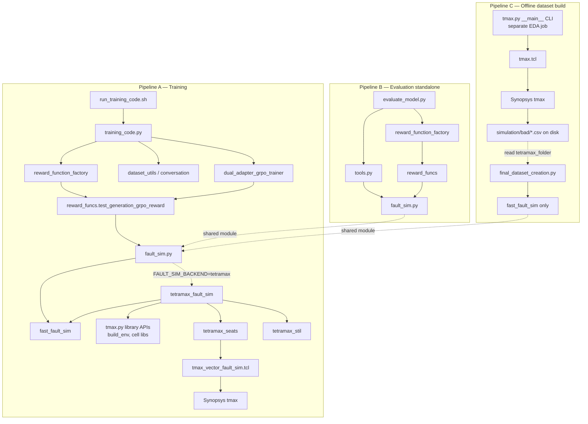

# Fault simulation call tree report

This report maps how fault simulation is invoked from training, evaluation, and offline dataset
construction — from top-level entry points down to Synopsys TetraMAX and Python simulators.

**Related modules:** `data_preprocessing/fault_sim.py`, `tetramax_seats.py`, `tetramax_stil.py`,
`tmax.py`, `libatpgllm/tests/reward_function_factory.py`, `libatpgllm/atpgllm/llm/reward_funcs.py`.

---

## Layer legend

| Level | Role |
|-------|------|
| **L0** | Shell / CLI entry |
| **L1** | Training, evaluation, or dataset orchestration |
| **L2** | Trainer loop or eval generation |
| **L3** | Reward / tool wiring |
| **L4** | Scoring and simulation API |
| **L5** | TetraMAX orchestration (Python) |
| **L6** | Subprocess, Tcl driver, vendor binary (**deepest**) |

---

## 1. GRPO training — reward path

Used every optimization step when `RewardFunctionFactory` is attached to the trainer.
If `FAULT_SIM_BACKEND=tetramax|hybrid`, TetraMAX may run once per scored completion (sequentially
inside the reward loop; seat-limited across processes via `tetramax_seats.py`).

```
L0  libatpgllm/tests/run_training_code.sh
 └── L1  libatpgllm/tests/training_code.py  (run_grpo_training)
      ├── L2  libatpgllm/tests/dataset_utils.py
      │        format_dataset_for_training()
      │        └── libatpgllm/tests/conversation.py  (ConversationExample.from_record)
      │
      ├── L2  libatpgllm/tests/reward_function_factory.py
      │        RewardFunctionFactory.create_reward_function() → reward_fn
      │
      └── L2  libatpgllm/tests/dual_adapter_grpo_trainer.py
           │   [or libatpgllm/tests/tool_calling_grpo_trainer.py]
           └── DualAdapterGRPOTrainer / ToolCallingGRPOTrainer  (TRL GRPOTrainer)
                └── _calculate_rewards()  [synchronous reward path]
                     └── L3  reward_fn(prompts, completions, **dataset columns)
                          └── L4  libatpgllm/atpgllm/llm/reward_funcs.py
                               test_generation_grpo_reward()  [sequential per completion]
                               ├── extractors: fault_fn, input_vector_fn, … (factory)
                               └── fault_sim_runner(...)  ← kwargs["fault_sim"]
                                    └── L5  data_preprocessing/fault_sim.py
                                         resolve_fault_sim_runner()
                                         │
                                         ├── [FAULT_SIM_BACKEND=fast]
                                         │    fast_fault_sim()
                                         │    └── OptimizedNetlist, netlist_utils
                                         │
                                         └── [FAULT_SIM_BACKEND=tetramax|hybrid]
                                              tetramax_fault_sim()
                                              ├── tetramax_seats.py  (cache / seat / timeout)
                                              ├── TetraMaxFaultSimulator.run_vector_fault_sim()
                                              │    ├── tetramax_stil.py  write_vector_stil()
                                              │    ├── tmax.py  build_env(), asap7_cell_libs()
                                              │    └── tetramax_seats.py  run_tmax_subprocess()
                                              │         └── acquire_tmax_seat()
                                              ├── fast_fault_sim()  (snapshot DataFrame)
                                              └── L6  subprocess: tmax -shell -tcl …
                                                   data_preprocessing/scripts/tmax_vector_fault_sim.tcl
                                                   └── Synopsys TetraMAX binary  ★ deepest
```

**Parallelism:** `num_generations` duplicates prompts in the trainer; `test_generation_grpo_reward`
still iterates completions **one at a time**. Under DDP, each rank scores its shard; shared seat
pool on a host is governed by `TMAX_MAX_CONCURRENT` (default `1`).

---

## 2. GRPO training — generation / tool path

During rollout, the model may call `fault_simulation_tool` before the final answer.

```
L0  run_training_code.sh
 └── L1  training_code.py
      └── L2  dual_adapter_grpo_trainer.py  [or tool_calling_grpo_trainer.py]
           _generate_tool_continuation() / generation
           └── tool_functions["fault_simulation_tool"]
                └── L3  libatpgllm/tests/tools.py
                     fault_simulation_tool_handler()
                     ├── OptimizedNetlist (RewardFunctionFactory + sim_config.json)
                     └── resolve_fault_sim_runner() → same L5/L6 tree as §1
```

---

## 3. Evaluation (`evaluate_model.py`)

```
L0  libatpgllm/tests/evaluate_model.py  (CLI)
 ├── L2  generate_with_tools() / diversity sampling
 │    └── execute_tool_call()
 │         └── L3  tools.py → fault_simulation_tool_handler() → L5/L6
 │
 └── L2  reward-based metrics (e.g. compute_rewards_for_completions)
      ├── L3  reward_function_factory.py
      └── L4  reward_funcs.py → test_generation_reward()
           └── resolve_fault_sim_runner() → L5/L6
```

Evaluation is typically sequential (one tool call or one reward batch at a time per trace).

---

## 4. Offline dataset construction (batch TetraMAX)

Gold `detected_faults` in `chrivasileiou/asap7-language-of-test-v2` come from this pipeline.
It is **not** started by `run_training_code.sh` and does **not** import `training_code.py` or
`evaluate_model.py`. GRPO only overlaps if you enable TetraMAX in rewards (`FAULT_SIM_BACKEND`).

```
L0  [separate EDA job]  python data_preprocessing/tmax.py
 └── L6  subprocess: tmax -shell -tcl
      data_preprocessing/scripts/tmax.tcl  ★ deepest (full ATPG + per-pattern sim)
      └── writes …/<module>/simulation/bad/machine_detected_faults_<N>.csv  (on disk)

L0  data_preprocessing/final_dataset_creation.py  (__main__)
 └── reads tetramax_folder CSVs (does not invoke tmax.py)
 └── L4  fault_sim.py  fast_fault_sim() only
      └── OptimizedNetlist + data_preprocessing/sim_config.json
```

---

## 5. Legacy reward path (inactive for current GRPO factory)

```
L4  libatpgllm/atpgllm/llm/reward_funcs.py
 └── [only if lib_gate_funcs is None]
      libatpgllm/atpgllm/llm/fault_coverage_calc.py  fault_sim()
```

`RewardFunctionFactory` always supplies `lib_gate_funcs` from `sim_config.json`, so production
GRPO uses `data_preprocessing/fault_sim.py`, not `fault_coverage_calc`.

---

## 6. Standalone utility (outside training tree)

```
L0  data_preprocessing/run_fault_simulations.py
 └── data_preprocessing/fault_simulator.py  run_simulation()
      (lightweight combinational sim; no TetraMAX)
```

---

## Layer cake (three independent pipelines)

These entry points do **not** call one another. They only share libraries under
`data_preprocessing/` (mainly `fault_sim.py`).

```
PIPELINE A — GRPO/SFT training (libatpgllm/tests/)
  run_training_code.sh  →  training_code.py only
    → dual_adapter_grpo_trainer / tool_calling_grpo_trainer
    → dataset_utils → conversation
    → reward_function_factory → reward_funcs
    → fault_sim.py (fast_fault_sim; optional tetramax via fault_sim, not tmax.py CLI)

PIPELINE B — model evaluation (standalone CLI)
  evaluate_model.py
    → tools.py, reward_function_factory, reward_funcs
    → fault_sim.py (same as A; does not import training_code or run_training_code.sh)

PIPELINE C — offline HF dataset build (data_preprocessing/)
  [optional, separate job]  python tmax.py  →  scripts/tmax.tcl  →  Synopsys tmax
       ↓ writes machine_detected_faults_*.csv on disk
  final_dataset_creation.py  →  reads tetramax_folder  →  fast_fault_sim only
    (does not call training_code.py, evaluate_model.py, or invoke tmax.py itself)

SHARED DEEPEST (when TetraMAX is used)
  subprocess: tmax
  ├─ scripts/tmax_vector_fault_sim.tcl   ← GRPO/eval if FAULT_SIM_BACKEND=tetramax (via fault_sim)
  └─ scripts/tmax.tcl                    ← batch ATPG only via tmax.py CLI (pipeline C)
```

---

## Files indexed by depth

| Depth | Paths |
|-------|--------|
| **L0** | `libatpgllm/tests/run_training_code.sh`, `training_code.py`, `evaluate_model.py`, `final_dataset_creation.py`, `tmax.py` |
| **L1–L2** | `dual_adapter_grpo_trainer.py`, `tool_calling_grpo_trainer.py`, `dataset_utils.py`, `conversation.py` |
| **L3** | `reward_function_factory.py`, `tools.py` |
| **L4** | `reward_funcs.py`, `fault_sim.py` (`OptimizedNetlist`, `fast_fault_sim`) |
| **L5** | `tetramax_fault_sim`, `tetramax_seats.py`, `tetramax_stil.py`, `tmax.py` |
| **L6** | `scripts/tmax_vector_fault_sim.tcl`, `scripts/tmax.tcl`, Synopsys `tmax` binary |

---

## TetraMAX license and runtime controls

Each L6 invocation is a **short-lived** `tmax` subprocess (not a daemon). Controls live in
`data_preprocessing/tetramax_seats.py`:

| Variable | Default | Effect |
|----------|---------|--------|
| `FAULT_SIM_BACKEND` | `fast` | `fast` / `tetramax` / `hybrid` |
| `TMAX_MAX_CONCURRENT` | `1` | Max simultaneous `tmax` processes per Unix user on a host |
| `TMAX_TIMEOUT_S` | `600` | Kill `tmax` after wall time (releases license) |
| `TMAX_ACQUIRE_TIMEOUT_S` | `1800` | Max wait for a free seat |
| `TMAX_LOCK_DIR` | `/tmp/tmax_seats_<uid>` | Seat lock files |
| `TMAX_RESULT_CACHE_SIZE` | `0` | In-process LRU for detection results (per process / DDP rank) |

**Recommendation:** keep `FAULT_SIM_BACKEND=fast` during long GRPO runs; use `tetramax` or `hybrid`
for evaluation or spot checks, with `TMAX_MAX_CONCURRENT` set to your licensed seat count.

---

## Mermaid overview (optional render in GitHub / IDE)

Three **separate** L0 pipelines. `run_training_code.sh` launches only `training_code.py` (never
`tmax.py`). `final_dataset_creation.py` does not call `training_code.py` or `evaluate_model.py`; it
reads precomputed TetraMAX artifacts from disk (often produced earlier by `python tmax.py`).



**Not shown (intentionally):** edges from `SH` to `tmax.py`, from `FDC` to `TC`/`EV`, or from
`TMX_CLI` to training — those paths do not exist in this repository.

---

*Generated for the transformers_atpg language-of-test / ATPG GRPO stack. Update this file when
new entry points or sim backends are added.*
